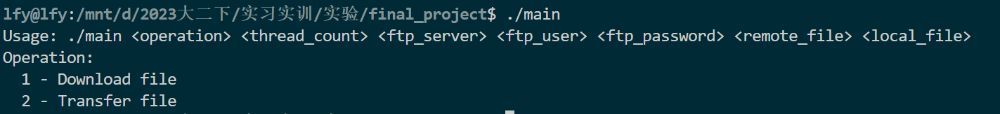
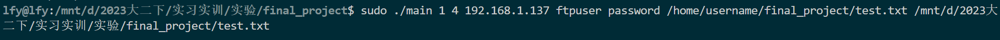

# phytium-training-NKUCS

首先编译，在命令行输入 `make`

运行可执行文件 `main`

对于第一条功能，分别是对应输入操作选择（从服务器中下载还是传输到服务器中），线程数选择，可以自行输入传输/下载线程数 ftp服务器，ftp的用户名 ftp用户的密码，远程文件的文件夹路径，本地文件的文件夹路径

示例如下

## 关于 `download(FTP多线程下载))`功能

会跳出提示信息

按照提示输入相应字符串

下载成功

