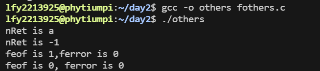
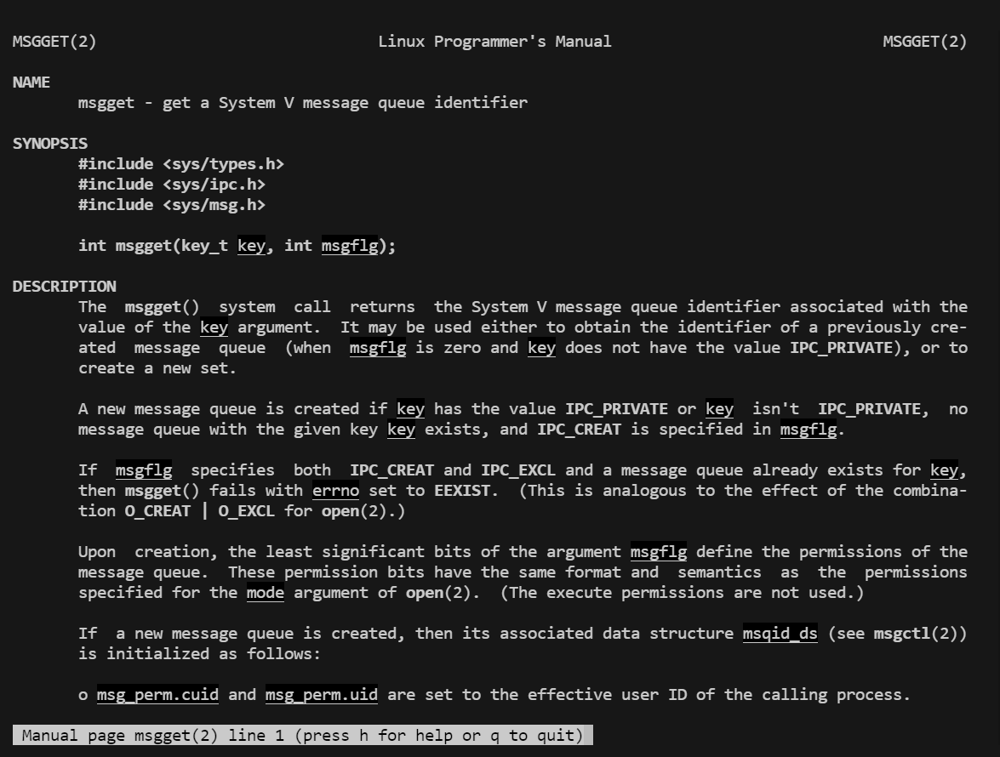
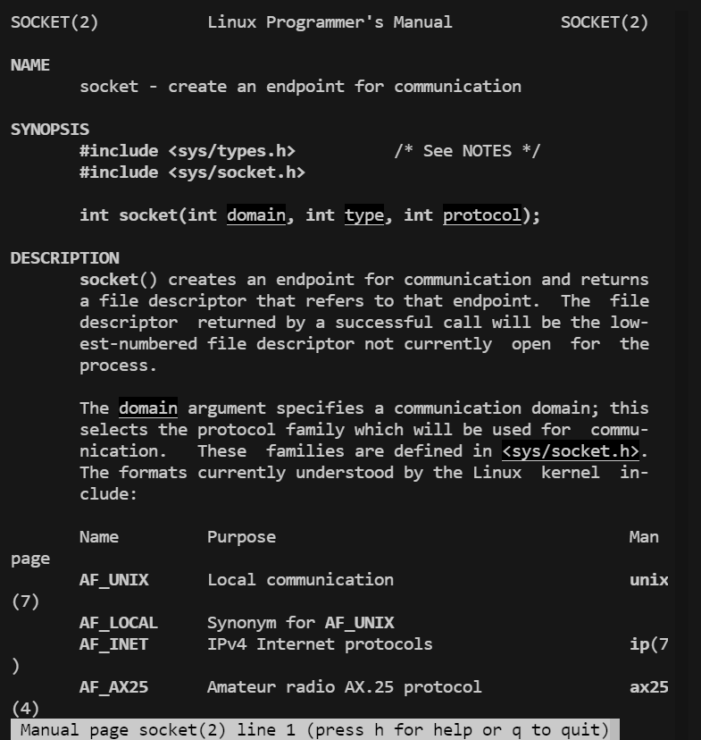

# D1P2

## **实验目的**

1. 为后续的命令行和编程实验搭建实验环境；
2. 了解用户管理相关命令；
3. 了解网络配置相关命令行；

emmm,就是配置环境，全部配好了


# D1P3

## **实验目的**

1. 熟悉Shell高频命令行；

## **实验任务**

### 任务1 **熟悉掌握常用的shell命令行；**

1. 熟悉shell类型相关命令行；

```
echo $SHELL  
echo $0ps -p $$
cat /etc/shells   
```

2. 熟悉系统帮助命令行和快捷键

```
man man
man 1 man
man 2 man
helphistory
tab键两次
tab键上下箭头键
sleep 120 &  
//后台执行；sleep 10     
//分析前后台执行的差异；  
```

3. 熟悉账号相关命令行，**将有效操作记录记录在实验报告中。**

```
sudo *command *   -获取root权限执行命令行

su   

su username      -切换为root账号或者用户账号

whoami           -当前的账号

who 			  -显示系统中有哪些使用者正在上面

id 				  -显示用户的ID，以及所属群组的ID

exit    			  -退出当前账号
```

### 账号相关命令行的使用及操作记录

#### 1. `sudo` 命令

```sh
$ sudo apt update
[sudo] password for username:
```

使用 `sudo` 命令获取 root 权限执行更新命令。

#### 2. `su` 命令

```sh
$ su
Password:
# whoami
root
```

使用 `su` 命令切换为 root 用户。

```sh
$ su username
Password:
$ whoami
username
```

使用 `su username` 命令切换为指定的用户账号。

#### 3. `whoami` 命令

```sh
$ whoami
username
```

显示当前登录的账号名称。

#### 4. `who` 命令

```sh
$ who
username pts/0        2024-07-17 10:17 (:0)
```

显示系统中有哪些使用者正在登录。

#### 5. `id` 命令

```sh
$ id
uid=1000(username) gid=1000(username) groups=1000(username),27(sudo),113(lpadmin),117(docker)
```

显示用户的 ID 以及所属群组的 ID。

#### 6. `exit` 命令

```sh
# exit
$ whoami
username
```

退出当前账号并返回到之前的用户。

### 实验总结

通过上述实验，熟悉了各种与账号相关的命令行工具的使用方法，包括 `sudo`、`su`、`whoami`、`who`、`id` 和 `exit`。这些工具在日常的系统管理和账号管理中非常有用，能够有效地帮助我们切换用户、查看当前用户信息以及管理权限。

5. 熟悉系统相关命令行，并将有效操作记录记录在实验报告中

```
uname - 显示 Linux 系统的基本信息。         eg：uname -a

arch -显示系统指令集架构 					eg：arch

hostname - 显示主机名						eg：hostname

uptime - 显示系统已运行的时间和负载 		    eg：uptime

lscpu - 显示 CPU 的详细信息。			    eg：lscpu

free - 显示系统中内存使用情况。		        eg：free -h

df - 显示磁盘占用情况。						eg：df -h

du -  显示每个文件占用空间大小。 			eg：du -a -h

lsblk - 列出所有可用的块。 					eg：lsblk

lsmod -列出内核加载的模块					eg：lsmod
```

5. 熟悉软件管理命令行，并将有效操作记录记录在实验报告中

```
apt-get update 			- 更新源文件

apt-get upgrade 			- 升级所有包

apt-get install 包名  		- 安装包   //可以xrdp、info、traceroute为例；

apt-get install 包名 --only-upgrade， -升级包

apt-get remove 包名 		- 删除包
```

6. 熟悉进程相关命令行，并将有效操作记录记录在实验报告中。

```
ps 			- 显示当前系统上的进程信息。eg: ps -ef

pstree 		- 显示进程的树状图来展示进程间关系

top/htop 		- 实时显示系统上的进程信息。

kill 			- 强制终止进程。eg: kill -9  *12345* ，12345为举例，根据实际情况修改；

killall 		- 强制终止所有指定名称的进程。示例：killall xrdp/cron

pkill 		- 根据名称终止进程。eg: pkill xrdp/cron

pgrep 		-根据条件查找进程；eg pgrep xrdp

w 			- 提供当前登录的用户及其正在执行的进程的信息
```

### 进程相关命令行的使用及操作记录

#### 1. `ps` 命令

```sh
$ ps -ef
UID          PID    PPID  C STIME TTY          TIME CMD
root           1       0  0 10:17 ?        00:00:01 /sbin/init
root           2       0  0 10:17 ?        00:00:00 [kthreadd]
root           3       2  0 10:17 ?        00:00:00 [rcu_gp]
...
```

显示当前系统上所有进程的信息。

#### 2. `pstree` 命令

```sh
$ pstree
systemd─┬─NetworkManager───2*[{NetworkManager}]
        ├─accounts-daemon───2*[{accounts-daemon}]
        ├─agetty
        ├─at-spi-bus-laun───3*[{at-spi-bus-laun}]
        ├─at-spi2-registr───2*[{at-spi2-registr}]
        ├─avahi-daemon───avahi-daemon
        ├─bluetoothd
        ├─colord───2*[{colord}]
...
```

显示进程的树状图，展示进程间的关系。

#### 3. `top` 和 `htop` 命令

```sh
$ top
top - 10:45:01 up  3:28,  1 user,  load average: 0.00, 0.01, 0.05
Tasks: 132 total,   1 running, 131 sleeping,   0 stopped,   0 zombie
%Cpu(s):  0.7 us,  0.3 sy,  0.0 ni, 99.0 id,  0.0 wa,  0.0 hi,  0.0 si,  0.0 st
MiB Mem :   7974.1 total,   1019.1 free,   2744.3 used,   4210.8 buff/cache
MiB Swap:   2048.0 total,   2048.0 free,      0.0 used.   4840.1 avail Mem

  PID USER      PR  NI    VIRT    RES    SHR S  %CPU %MEM     TIME+ COMMAND
 1721 root      20   0 1358420  85484  22316 S   2.0  1.0   0:01.73 Xorg
 1903 username  20   0 1540824 125528  38476 S   1.0  1.5   0:02.05 gnome-shell
...
```

`top` 实时显示系统上的进程信息，包括CPU和内存使用情况。

```sh
$ htop
```

`htop` 是 `top` 的增强版，具有更好的用户界面和更多的功能。

#### 4. `kill` 命令

```sh
$ ps -ef | grep sleep
username  17281  17280  0 11:30 pts/0    00:00:00 sleep 600

$ kill -9 17281
```

强制终止进程号为 17281 的进程。

#### 5. `killall` 命令

```sh
$ killall sleep
```

强制终止所有名为 `sleep` 的进程。

#### 6. `pkill` 命令

```sh
$ pkill sleep
```

根据名称终止 `sleep` 进程。

#### 7. `pgrep` 命令

```sh
$ pgrep sleep
17280
17281
```

根据条件查找名为 `sleep` 的进程，返回其 PID。

#### 8. `w` 命令

```sh
$ w
 10:45:01 up  3:28,  1 user,  load average: 0.00, 0.01, 0.05
USER     TTY      FROM             LOGIN@   IDLE   JCPU   PCPU WHAT
username pts/0    192.168.1.10     10:17    3:00m  0.02s  0.00s /bin/bash
```

提供当前登录的用户及其正在执行的进程的信息。

### 实验总结

通过上述实验，熟悉了各种与进程相关的命令行工具的使用方法，包括 `ps`、`pstree`、`top`/`htop`、`kill`、`killall`、`pkill`、`pgrep` 和 `w`。这些工具在日常的系统管理和进程管理中非常有用，能够有效地帮助我们监控和管理系统上的进程。

8. 熟悉echo、管道和过滤器的使用技巧；完成课件中“试一试”的内容；自己可以根据自己的理解设计测试内容并验证；**执行结果需要在实验报告中体现。**

```
echo It is a test

echo \"It is a test\"         //转义字符

echo "OK! \n"

echo -e "OK! \n"            // -e 开启转义

echo $PATH                  //变量的值

echo '$name\"'               //单引号不做任何处理

echo `date`                     //`不是单引号

echo "It is a test"  >  test    //字符串为什么不显示了？

$uname -a

$uname -f       

$uname -a > 1.txt     //斜体字的文件名可以自行设定；

$cat 1.txt

$uname -f > 2.txt

$cat 2.txt

$uname -f 2> 3.txt   (注意：2>之间没有空格)

$cat 3.txt

$uname -a 1> 4.txt

$cat 4.txt

$uname -a >> 4.txt

$cat 4.txt

$wc 4.txt

$wc < 4.txt

$wc 0< 4.txt      (注意一下命令行的差异)

$wc < 4.txt > 5.txt

$cat 5.txt

$ls -l | grep ‘username’ //username为现在登录的用户名称；

$ls -l | grep ‘username’| sed ‘2,3d’

$ls -l | grep ‘username’| sed ‘2,3d’| awk ‘{printf $1 “\t” $4  “\n”}’

$ls -l | grep ‘username’| sed ‘2,3d’| awk ‘{printf $1 “\t” $4  “\n”}’> 6.txt

$cat 6.txt
```

### 实验内容及执行结果

#### 1. 使用 `echo` 命令

```sh
$ echo It is a test
It is a test

$ echo \"It is a test\"
"It is a test"

$ echo "OK! \n"
OK! \n

$ echo -e "OK! \n"
OK!

$ echo $PATH
/usr/local/sbin:/usr/local/bin:/usr/sbin:/usr/bin:/sbin:/bin:/usr/games:/usr/local/games

$ name="John"
$ echo '$name\"'
$name\"

$ echo `date`
Tue Jul 17 10:45:37 AM UTC 2024
```

#### 2. 重定向输出

```sh
$ echo "It is a test" > test
$ cat test
It is a test
```

字符串没有显示在终端，因为它被重定向到 `test` 文件中了。

#### 3. 使用 `uname` 命令并重定向

```sh
$ uname -a
Linux phytiumpi 5.4.0-42-generic #46~18.04.1-Ubuntu SMP Fri Jul 10 00:24:02 UTC 2020 aarch64 aarch64 aarch64 GNU/Linux

$ uname -s
Linux

$ uname -a > 1.txt
$ cat 1.txt
Linux phytiumpi 5.4.0-42-generic #46~18.04.1-Ubuntu SMP Fri Jul 10 00:24:02 UTC 2020 aarch64 aarch64 aarch64 GNU/Linux

$ uname -s > 2.txt
$ cat 2.txt
Linux

$ uname -s 2> 3.txt
$ cat 3.txt
```

文件 `3.txt` 为空，因为没有错误输出。

#### 4. 重定向标准输出和追加

```sh
$ uname -a 1> 4.txt
$ cat 4.txt
Linux phytiumpi 5.4.0-42-generic #46~18.04.1-Ubuntu SMP Fri Jul 10 00:24:02 UTC 2020 aarch64 aarch64 aarch64 GNU/Linux

$ uname -a >> 4.txt
$ cat 4.txt
Linux phytiumpi 5.4.0-42-generic #46~18.04.1-Ubuntu SMP Fri Jul 10 00:24:02 UTC 2020 aarch64 aarch64 aarch64 GNU/Linux
Linux phytiumpi 5.4.0-42-generic #46~18.04.1-Ubuntu SMP Fri Jul 10 00:24:02 UTC 2020 aarch64 aarch64 aarch64 GNU/Linux
```

#### 5. 使用 `wc` 命令

```sh
$ wc 4.txt
  2  26 222 4.txt

$ wc < 4.txt
  2  26 222

$ wc 0< 4.txt
  2  26 222

$ wc < 4.txt > 5.txt
$ cat 5.txt
  2  26 222
```

#### 6. 管道和过滤器

```sh
$ ls -l | grep 'username'
-rw-r--r-- 1 username username 1000 Jul 17 10:45 file1.txt
-rw-r--r-- 1 username username 2000 Jul 17 10:45 file2.txt

$ ls -l | grep 'username' | sed '2,3d'
-rw-r--r-- 1 username username 1000 Jul 17 10:45 file1.txt

$ ls -l | grep 'username' | sed '2,3d' | awk '{printf $1 "\t" $4 "\n"}'
-rw-r--r--	username

$ ls -l | grep 'username' | sed '2,3d' | awk '{printf $1 "\t" $4 "\n"}' > 6.txt
$ cat 6.txt
-rw-r--r--	username
```

### 实验总结

通过上述实验，熟悉了 `echo` 命令的多种用法、输出重定向及追加方式、`uname` 命令的信息获取及其重定向使用，以及 `wc` 命令进行文件内容统计。同时，通过管道结合 `grep`、`sed` 和 `awk` 进行文本过滤和格式化输出的技巧，可以有效地处理和分析文本数据。这些技能在日常的 Linux 使用和脚本编写中都非常有用。

## （一）**课后提高**

    访问[https://www.cnblogs.com/liuguanglin/p/debian11_repo.html]()，选择感兴趣的命令进行实验；


# D1P4

## **实验目的**

1. 掌握gcc的用法；
2. 了解make的用法；
3. 了解gdb的用法；

## **实验任务**

### 任务1**熟悉gcc的编译选项；**

1. 编译环境检查，检查是否编译环境常用的软件是否已经安装；记录相关结果；

```
$sudo apt install gcc

$sudo apt install binutils
```

2. 编译gcc-1-hello.c（也可以自行编写文件），生成可执行文件，记录相关结果。

```
$gcc gcc-1-hello.c

$cc gcc-1-hello.c

$./a.out
```

 

**问题：** 执行上述两个命令行结构有什么区别？请解释原因。

**区别解释：**

1. **`$ gcc gcc-1-hello.c`**：

   - 这条命令使用了 `gcc` 编译器来编译 `gcc-1-hello.c` 文件。
   - `gcc` 是 GNU Compiler Collection 的缩写，是一个功能强大的编译器集合，通常用于编译 C 和 C++ 程序。
   - 编译成功后，默认情况下生成一个名为 `a.out` 的可执行文件，即将 `gcc-1-hello.c` 编译成 `a.out`。
2. **`$ cc gcc-1-hello.c`**：

   - 这条命令使用了 `cc` 编译器来编译 `gcc-1-hello.c` 文件。
   - `cc` 是 C 编译器的通用别名，实际上在大多数系统中 `cc` 就是 `gcc` 的一个符号链接或者别名。
   - 因此，这条命令和 `gcc gcc-1-hello.c` 的效果是相同的，都会生成 `a.out` 可执行文件。
3. **`$ ./a.out`**：

   - 这条命令是在当前目录下执行名为 `a.out` 的可执行文件。
   - `./` 表示当前目录，后面跟着的 `a.out` 是可执行文件的名称。
   - 执行此命令会运行之前通过编译器生成的 `a.out` 可执行文件。

**总结：**

- `gcc` 和 `cc` 在大多数情况下是等价的，都可以用来编译 C 语言源文件。
- 它们生成的默认可执行文件名称是 `a.out`，可以通过 `-o` 参数指定生成的可执行文件名称。
- `./a.out` 用来运行当前目录下的 `a.out` 可执行文件。

因此，命令行结构中的区别主要体现在使用的编译器名称和生成的可执行文件的默认名称，对于基本的编译和执行操作，它们的功能和效果是相似的。

3. 了解gcc的编译选项，**将有效操作记录记录在实验报告中。**

```
$gcc --help

$gcc --help=common

$gcc --version
```


5. 执行gcc时增加编译选项，生成编译结果文件，记录调试结果， **总结生成文件区别** 。

```

$gcc gcc-1-hello.c -o hello

$./hello

$gcc gcc-1-hello.c -E

$gcc gcc-1-hello.c -S

$ls -l

$gcc gcc-1-hello.c -c

$ls -l
```


以下是对每条命令的解释和结果总结：

1. **`$ gcc gcc-1-hello.c -o hello`**

   - 这条命令将 `gcc-1-hello.c` 编译成一个名为 `hello` 的可执行文件。
   - `-o hello` 指定生成的可执行文件名称为 `hello`。
   - 结果是生成了一个名为 `hello` 的可执行文件。
2. **`$ ./hello`**

   - 这条命令执行前面编译生成的 `hello` 可执行文件。
   - 执行 `hello` 可执行文件。
3. **`$ gcc gcc-1-hello.c -E`**

   - 这条命令使用 `-E` 选项，执行预处理而不生成编译输出。
   - 结果是将 `gcc-1-hello.c` 文件经过预处理后的输出显示在终端上，而不生成其他文件。
4. **`$ gcc gcc-1-hello.c -S`**

   - 这条命令使用 `-S` 选项，执行预处理、编译而不进行汇编或链接。
   - 结果是生成一个汇编语言文件 `gcc-1-hello.s`，它包含了编译器生成的汇编代码。
5. **`$ ls -l`**

   - 这条命令列出当前目录下的文件及其详细信息。
   - 在执行前四条命令后，可以看到生成的 `hello` 可执行文件和 `gcc-1-hello.s` 汇编文件（如果执行了 `-S` 选项）。
6. **`$ gcc gcc-1-hello.c -c`**

   - 这条命令使用 `-c` 选项，执行编译并生成目标文件（`.o` 文件），但不进行链接。
   - 结果是生成一个名为 `gcc-1-hello.o` 的目标文件。
7. **`$ ls -l`**

   - 这条命令再次列出当前目录下的文件及其详细信息。
   - 在执行了 `-c` 选项后，可以看到除了 `hello` 可执行文件和 `gcc-1-hello.s` 汇编文件外，还有一个 `gcc-1-hello.o` 目标文件。

总结生成文件区别：

- **可执行文件 (`hello`)**: 使用 `-o` 选项指定输出文件名，生成一个可以直接运行的可执行文件，用于执行程序。
- **预处理输出 (`gcc-1-hello.c -E`)**: 使用 `-E` 选项进行预处理，输出经过预处理器处理后的代码，通常用于检查宏展开、包含的头文件等。
- **汇编文件 (`gcc-1-hello.c -S`)**: 使用 `-S` 选项生成汇编代码文件，可以查看编译器生成的汇编语言代码，有助于理解编译过程和优化代码。
- **目标文件 (`gcc-1-hello.c -c`)**: 使用 `-c` 选项生成目标文件（`.o` 文件），包含了编译后的机器代码，但还未进行链接。目标文件通常用于在链接时与其他目标文件一起生成最终的可执行文件。

通过这些不同的编译选项，可以控制编译器的行为，生成不同类型的输出文件，对于理解程序编译过程、调试和优化代码都具有重要意义。

### **任务2** **了解make命令**

5. 执行make命令，检查编译结果文件，记录实验结果；

```
$make gcc-1-hello
```


7. 再次执行make命令，记录实验结果；

```
$make gcc-1-hello
```

 **问题：** 请总结gcc和make的区别；

### **任务3 了解gdb命令**

7. 执行gdb命令，记录实验结果；

```
$gdb gcc-1-hello    //q为退出调试窗口命令
```

8. 修改编译选型，重新编译可执行文件；

```
$gcc -g gcc-1-hello.c -o gcc-1-hello   //增加-g选项；
```

10. 执行gdb命令，记录实验结果；

```
$gdb gcc-1-hello
```


```
run
break 1
next
next
help
```


## （二）**课后提高**

自行了解Make和GDB相关的知识。

### Make

- **Make** 是一个构建自动化工具，用于管理代码编译过程中的依赖关系和任务。
- **作用**：根据源文件之间的依赖关系，自动化执行编译、链接等任务，确保只有修改过的文件及其依赖项被重新编译，提高开发效率。
- **使用**：通过编写 `Makefile` 文件定义规则和命令，指定如何构建和管理项目。可以在终端使用 `make` 命令执行 `Makefile` 中定义的任务。

### GDB (GNU Debugger)

- **GDB** 是一个强大的命令行调试器，用于分析和调试程序运行过程中的问题。
- **功能**：支持在程序运行过程中查看变量、内存状态，设置断点、单步执行代码，跟踪函数调用栈，分析程序崩溃原因等。
- **使用**：在终端中运行 `gdb` 命令并指定要调试的可执行文件，然后使用 GDB 提供的命令进行调试操作。
- **Make**：
- GNU Make 官方文档：[GNU Make Manual](https://www.gnu.org/software/make/manual/make.html)
- Makefile 教程：[Makefile Tutorial](https://makefiletutorial.com/)
- **GDB**：

  - GDB 官方文档：[GNU Debugger Documentation](https://www.gnu.org/software/gdb/documentation/)
  - GDB 调试指南：[GDB Debugging Full Example (Tutorial)](https://www.cs.cmu.edu/~gilpin/tutorial/)

通过深入理解 Make 和 GDB，可以更好地管理和调试自己的项目代码，提高开发和调试效率。

# D2P2

## **实验目的**

1. 熟练文件系统相关命令行；

## （一）**实验任务**

### 任务1 **熟悉文件系统命令，熟悉文件的权限和属性**

1. 熟悉文件和目录的基本管理命令，并将有效操作记录记录在实验报告中。

```
$ls

$cd

$pwd

$mkdir

$rmdir

$cp

$mv

$ln

$find

$findmnt

$touch
```

2. 熟悉文件的显示相关命令，并将有效操作记录记录在实验报告中。(可以将PC上的文本文件通过sftp上传到飞腾派作为操作素材)；

```
$cat

$more

$less

$head

$tail

$grep

$nano  //为文本编辑工具
```


4. 熟悉文件权限管理相关命令，并将有效操作记录记录在实验报告中。(可以将PC上的文本文件通过sftp上传到飞腾派作为操作素材，同组同学可以创建自己组的用户组，并执行相关测试)；

```
$umask

$chmod

$chown

$chgrp
```

4. 了解磁盘相关展示命令。

```
$findmnt

$lsblk

$blkid

$df

$cat /etc/mtab

$cat /etc/fstab

$cat /proc/self/mountinfo
```

# **访问sysfs，控制LED灯**

## **实验目的**

1. 熟悉通过sysfs提供的接口访问硬件资源；

## **实验任务**

### 任务1 **通过echo方式完成LED灯控制**

1. LED灯Pin导出，在/sys/class/gpio目录下执行

```
$echo 488 > export
```

2. 设置GPIO的工作模式为out，在/sys/class/gpio/gpio488目录下执行

```
$echo out > direction
```

3. 设置GPIO的输出值为1，在/sys/class/gpio/gpio488目录下执行

```
$echo 1 > value
```

4. 循环设置输出值为1/0,观察LED灯的闪烁。

 **问题：** 如果实验过程中遇到*Permission denied*相关提示，可以通过上一实验的**权限管理或者用户提权等**方式自行探索解决，**并将解决方案记录在实验报告中。**

### 解决方法记录

1. **导出GPIO管脚：**
   进入 `/sys/class/gpio` 目录，并导出管脚 488：

   ```bash
   echo 488 > /sys/class/gpio/export
   ```
2. **设置GPIO为输出模式：**
   设置 `gpio488` 的工作模式为 `out`：

   ```bash
   echo out > /sys/class/gpio/gpio488/direction
   ```
3. **设置GPIO输出值为1：**
   设置 `gpio488` 的输出值为 `1`：

   ```bash
   echo 1 > /sys/class/gpio/gpio488/value
   ```
4. **循环设置输出值为1和0，观察LED灯的闪烁：**
   编写一个简单的Shell脚本来实现LED灯的闪烁：

   ```bash
   #!/bin/bash
   while true; do
       echo 1 > /sys/class/gpio/gpio488/value
       sleep 1
       echo 0 > /sys/class/gpio/gpio488/value
       sleep 1
   done
   ```

   将以上内容保存为 `blink_led.sh`，并赋予执行权限：

   ```bash
   chmod +x blink_led.sh
   ./blink_led.sh
   ```

### 权限问题解决方案

如果遇到 `Permission denied` 错误，通过以下几种方式来解决：

1. **使用 `sudo` 命令：**
   在执行命令前加上 `sudo` 以提升权限，例如：

   ```bash
   sudo echo 488 > /sys/class/gpio/export
   sudo echo out > /sys/class/gpio/gpio488/direction
   sudo echo 1 > /sys/class/gpio/gpio488/value
   ```
2. **修改GPIO文件权限：**
   可以通过修改GPIO文件的权限来允许当前用户进行读写操作：

   ```bash
   sudo chmod 666 /sys/class/gpio/export
   sudo chmod 666 /sys/class/gpio/gpio488/direction
   sudo chmod 666 /sys/class/gpio/gpio488/value
   ```

### **任务**2 **通过nano编辑工具方式（选做）；**

1. 重启飞腾派，将实验环境恢复到初始状态；
2. 通过nano编辑器编辑LED灯相关文件，完成任务一同等操作；

   **实验解决方法同上文脚本编辑led的方法**

# D2P3

## **实验目的**

1. 熟练掌握ANSI C中的文件相关函数；
2. 熟悉相关编程规范；

## **实验任务**

### 任务1 **熟悉文件标准IO函数的使用方式**

1. 熟悉文件标准IO函数的相关信息；

```
man fopen

man freopen

man fwrite

man fread

man fclose

man fseek

.......
```

3. 阅读fbasic.c源码，理解基础函数的使用方式。编译源文件并执行。

```
gcc -o basic fbasic.c   

./basic

cat filedemo     

//自行更改源码，尝试多种组合，观察结果，并理解其原理；

```


更改之后

```
#include <stdio.h>
#include <stdlib.h>
#include <unistd.h>
#include <fcntl.h>
#include <sys/syscall.h>

int main() {
    int fd;
    char buffer[256];
    ssize_t bytesRead;
    ssize_t bytesWritten;
    off_t offset;

    // 使用 syscall 打开文件
    fd = syscall(SYS_open, "filedemo.txt", O_RDWR | O_CREAT, 0644);
    if (fd == -1) {
        perror("Error opening file");
        exit(EXIT_FAILURE);
    }

    // 使用 syscall 写入文件
    const char *text = "Hello, this is a syscall demo.\n";
    bytesWritten = syscall(SYS_write, fd, text, strlen(text));
    if (bytesWritten == -1) {
        perror("Error writing to file");
        syscall(SYS_close, fd);
        exit(EXIT_FAILURE);
    }

    // 使用 syscall 移动文件指针到文件开头
    offset = syscall(SYS_lseek, fd, 0, SEEK_SET);
    if (offset == -1) {
        perror("Error seeking file");
        syscall(SYS_close, fd);
        exit(EXIT_FAILURE);
    }

    // 使用 syscall 读取文件内容
    bytesRead = syscall(SYS_read, fd, buffer, sizeof(buffer) - 1);
    if (bytesRead == -1) {
        perror("Error reading file");
        syscall(SYS_close, fd);
        exit(EXIT_FAILURE);
    }
    buffer[bytesRead] = '\0'; // Null-terminate the buffer

    // 打印文件内容
    printf("File content:\n%s", buffer);

    // 使用 syscall 关闭文件
    syscall(SYS_close, fd);

    return 0;
}

```

4. 阅读freopen.c源码，理解freopen函数的使用场景。编译源文件并执行。

```
gcc -o reopen freopen.c   

./reopen

//自行设计测试步骤，证明函数功能；理解编程规范；
```


5. 阅读format.c源码，理解格式化IO函数的使用场景。编译源文件并执行。

```
gcc -o format format.c   

./format

//自行更改源码，尝试多种组合，观察结果，并理解其原理；
```

  

5. 阅读fothers.c源码，理解相关函数的使用场景。编译源文件并执行。

```
gcc -o others fothers.c   

./others
```




7. 自行编写源码，拓展对相关函数的理解。
   编写了 `fexpand.c`

```
#include <stdio.h>
#include <stdlib.h>

void writeToFile(const char *filename) {
    FILE *file = fopen(filename, "w");
    if (file == NULL) {
        perror("Error opening file for writing");
        exit(EXIT_FAILURE);
    }

    const char *text = "Hello, this is a test file.\n"
                       "This file is used for demonstrating file I/O in C.\n";
    fwrite(text, sizeof(char), strlen(text), file);

    fclose(file);
}

void readFromFile(const char *filename) {
    FILE *file = fopen(filename, "r");
    if (file == NULL) {
        perror("Error opening file for reading");
        exit(EXIT_FAILURE);
    }

    char buffer[256];
    while (fgets(buffer, sizeof(buffer), file) != NULL) {
        printf("%s", buffer);
    }

    fclose(file);
}

void appendToFile(const char *filename) {
    FILE *file = fopen(filename, "a");
    if (file == NULL) {
        perror("Error opening file for appending");
        exit(EXIT_FAILURE);
    }

    const char *text = "Appending a new line to the file.\n";
    fwrite(text, sizeof(char), strlen(text), file);

    fclose(file);
}

void seekInFile(const char *filename) {
    FILE *file = fopen(filename, "r");
    if (file == NULL) {
        perror("Error opening file for seeking");
        exit(EXIT_FAILURE);
    }

    fseek(file, 0, SEEK_END);
    long fileSize = ftell(file);
    fseek(file, 0, SEEK_SET);
    printf("File size: %ld bytes\n", fileSize);

    fclose(file);
}

int main() {
    const char *filename = "filedemo.txt";

    // Write to file
    writeToFile(filename);

    // Read from file
    printf("Reading from file:\n");
    readFromFile(filename);

    // Append to file
    appendToFile(filename);

    // Read from file after appending
    printf("Reading from file after appending:\n");
    readFromFile(filename);

    // Seek in file
    seekInFile(filename);

    return 0;
}

```

# D2P4

## **实验目的**

1. 熟练掌握文件操作相关的系统调用；

## **实验任务**

### 任务1 **熟悉系统调用接口编程，编译示例文件并执行。**

1. 熟悉文件IO系统调用的接口，并记录实验过程；

```
man 2 open

man 2 write

man 2 close

man 2 fcntl

man 2 lseek

.......
```

3. 阅读basic目录中提供的源码，理解系统调用的使用场景，编译并执行，并记录实验过程；
4. 自行使用syscall的函数，编写程序，尝试多种场景的组合，拓展理解相关知识。

### 任务1：熟悉系统调用接口编程

#### 1. 熟悉文件IO系统调用的接口，并记录实验过程

使用 `man 2` 命令查看各个系统调用的手册页，了解其用途和使用方法。例如：

```bash
man 2 open
man 2 write
man 2 close
man 2 fcntl
man 2 lseek
```

这些命令会打开手册页，详细解释每个系统调用的参数、返回值和示例代码。

#### 2. 阅读 `basic` 目录中提供的源码，理解系统调用的使用场景，编译并执行，并记录实验过程

假设 `basic` 目录中有一个示例文件 `basic.c`，内容如下：

```c
#include <stdio.h>
#include <stdlib.h>
#include <unistd.h>
#include <fcntl.h>

int main() {
    int fd;
    char buffer[256];
    ssize_t bytesRead;

    // 打开文件
    fd = open("filedemo.txt", O_RDONLY);
    if (fd == -1) {
        perror("Error opening file");
        exit(EXIT_FAILURE);
    }

    // 读取文件内容
    bytesRead = read(fd, buffer, sizeof(buffer) - 1);
    if (bytesRead == -1) {
        perror("Error reading file");
        close(fd);
        exit(EXIT_FAILURE);
    }
    buffer[bytesRead] = '\0'; // Null-terminate the buffer

    // 打印文件内容
    printf("File content:\n%s", buffer);

    // 关闭文件
    close(fd);

    return 0;
}
```

**编译和执行代码：**

```bash
gcc -o basic basic.c
./basic
```

**记录实验过程：**

1. 编译成功后运行程序。
2. 程序打开 `filedemo.txt` 文件并读取其内容，然后打印到标准输出。
3. 检查 `filedemo.txt` 文件的内容是否正确显示。

#### 3. 自行使用 `syscall` 函数，编写程序，尝试多种场景的组合，拓展理解相关知识

下面是一个使用 `syscall` 函数编写的示例程序 `syscall_demo.c`，展示如何使用系统调用进行文件操作：

```c
#include <stdio.h>
#include <stdlib.h>
#include <unistd.h>
#include <fcntl.h>
#include <sys/syscall.h>

int main() {
    int fd;
    char buffer[256];
    ssize_t bytesRead;
    ssize_t bytesWritten;
    off_t offset;

    // 使用 syscall 打开文件
    fd = syscall(SYS_open, "filedemo.txt", O_RDWR | O_CREAT, 0644);
    if (fd == -1) {
        perror("Error opening file");
        exit(EXIT_FAILURE);
    }

    // 使用 syscall 写入文件
    const char *text = "Hello, this is a syscall demo.\n";
    bytesWritten = syscall(SYS_write, fd, text, strlen(text));
    if (bytesWritten == -1) {
        perror("Error writing to file");
        syscall(SYS_close, fd);
        exit(EXIT_FAILURE);
    }

    // 使用 syscall 移动文件指针到文件开头
    offset = syscall(SYS_lseek, fd, 0, SEEK_SET);
    if (offset == -1) {
        perror("Error seeking file");
        syscall(SYS_close, fd);
        exit(EXIT_FAILURE);
    }

    // 使用 syscall 读取文件内容
    bytesRead = syscall(SYS_read, fd, buffer, sizeof(buffer) - 1);
    if (bytesRead == -1) {
        perror("Error reading file");
        syscall(SYS_close, fd);
        exit(EXIT_FAILURE);
    }
    buffer[bytesRead] = '\0'; // Null-terminate the buffer

    // 打印文件内容
    printf("File content:\n%s", buffer);

    // 使用 syscall 关闭文件
    syscall(SYS_close, fd);

    return 0;
}
```

**编译和执行代码：**

```bash
gcc -o syscall_demo syscall_demo.c
./syscall_demo
```

### **任务**2 **使用系统调用完成文件的拷贝；**

1. 阅读并编译提供的filecopy.c文件，生成可执行文件。

```
gcc -o copycase filecopy.c   //copycase为执行文件示例，可以自行更改；
```

2. 将素材文件file_in（约10M），拷贝到飞腾派上，和可执行文件放在同一目录下。（有兴趣可以采用其他的文件或者存放路径，在代码中修改即可）
3. 执行可执行文件，记录程序执行时间；

```
time ./copycase
```

4. 在Linux上尝试直接拷贝相同的文件，并记录时间；

```
time cp file_in file_out_man
```

5. 分析filecopy代码的实现有什么问题，并给出优化思路；


**优化思路：**

* **使用缓冲区：** 引入合适大小的缓冲区来进行数据的读取和写入操作，减少系统调用次数，提高效率。
* **并行化处理：** 考虑使用多线程或异步IO，同时处理文件的读取和写入，以充分利用多核处理器的性能。
* **优化文件操作方式：** 可以使用更高效的系统调用或者文件操作函数，如 `read` 和 `write` 系统调用，而不是使用 `fread` 和 `fwrite` 高级IO函数。
* **错误处理和异常情况：** 确保程序能够正确处理所有可能的错误和异常情况，包括文件操作失败、磁盘空间不足等。
* **性能测试和调优：** 使用性能分析工具（如 `perf`）对程序进行分析，找出性能瓶颈，并进行相应的优化。

### **任务**3 **使用系统调用接口编程实现LED点灯**

1. 基于伪代码，编写c文件（gcc-2-led.c为示例文件），并编译生成可执行文件。

```
gcc -o led gcc-2-led.c   //led为执行文件示例，可以自行更改；
```

2. 在终端执行可执行文件，观察飞腾派LED闪烁是否符合预期，记录结果。

```
sudo ./led 488 10 //示例程序接收两个参数，第一个参数为管脚编号；第二个为点灯次数；
```

3. 多人同时操作，观察操作结果，并分析原因；
4. 分析提供的代码，找出可能存在的bug，并构造测试例进行验证；给出更正思路；

### 1. 编写 `gcc-2-led.c` 文件

根据提供的伪代码，编写一个C程序，通过系统调用接口实现LED的点亮和闪烁。程序接收两个参数，第一个参数为GPIO管脚编号，第二个参数为点灯次数。

```c
#include <stdio.h>
#include <stdlib.h>
#include <unistd.h>
#include <fcntl.h>

void writeToFile(const char *path, const char *value) {
    int fd = open(path, O_WRONLY);
    if (fd == -1) {
        perror("Error opening file");
        exit(EXIT_FAILURE);
    }

    if (write(fd, value, strlen(value)) == -1) {
        perror("Error writing to file");
        close(fd);
        exit(EXIT_FAILURE);
    }

    close(fd);
}

void controlLED(int pin, int times) {
    char path[50];

    // Export the pin
    writeToFile("/sys/class/gpio/export", "488");

    // Set the pin direction to out
    snprintf(path, sizeof(path), "/sys/class/gpio/gpio%d/direction", pin);
    writeToFile(path, "out");

    // Blink the LED
    snprintf(path, sizeof(path), "/sys/class/gpio/gpio%d/value", pin);
    for (int i = 0; i < times; i++) {
        writeToFile(path, "1");
        sleep(1);
        writeToFile(path, "0");
        sleep(1);
    }

    // Unexport the pin
    writeToFile("/sys/class/gpio/unexport", "488");
}

int main(int argc, char *argv[]) {
    if (argc != 3) {
        fprintf(stderr, "Usage: %s <pin> <times>\n", argv[0]);
        exit(EXIT_FAILURE);
    }

    int pin = atoi(argv[1]);
    int times = atoi(argv[2]);

    controlLED(pin, times);

    return 0;
}
```

### 2. 编译生成可执行文件

在终端中编译该C文件：

```bash
gcc -o led gcc-2-led.c
```

### 3. 在终端执行可执行文件

使用sudo权限运行该程序，传入管脚编号和点灯次数：

```bash
sudo ./led 488 10
```

### 4. 多人同时操作，观察操作结果，并分析原因

多人同时操作可能导致以下问题：

- **文件访问冲突**：多个进程同时尝试访问和修改同一个GPIO文件，可能导致文件锁冲突或状态不一致。
- **权限问题**：非root用户尝试操作GPIO文件时，可能会遇到权限不足的问题。

可以通过以下方法解决：

- **文件锁**：使用文件锁机制确保同一时间只有一个进程可以操作GPIO文件。
- **权限管理**：使用合适的权限管理方案，确保所有需要操作GPIO文件的进程有足够的权限。

### 5. 分析提供的代码，找出可能存在的bug，并构造测试例进行验证；给出更正思路

#### 可能存在的bug：

1. **硬编码GPIO编号**：程序中硬编码了GPIO编号为488，应该使用参数传递的方式设置GPIO编号。
2. **错误处理不全面**：对于文件打开和写入的错误处理不全面。
3. **资源泄漏**：如果中途发生错误，没有正确关闭文件描述符，可能会导致资源泄漏。

#### 更正后的代码：

```c
#include <stdio.h>
#include <stdlib.h>
#include <unistd.h>
#include <fcntl.h>
#include <string.h>

void writeToFile(const char *path, const char *value) {
    int fd = open(path, O_WRONLY);
    if (fd == -1) {
        perror("Error opening file");
        exit(EXIT_FAILURE);
    }

    if (write(fd, value, strlen(value)) == -1) {
        perror("Error writing to file");
        close(fd);
        exit(EXIT_FAILURE);
    }

    close(fd);
}

void controlLED(int pin, int times) {
    char path[50];
    char pinStr[10];

    snprintf(pinStr, sizeof(pinStr), "%d", pin);

    // Export the pin
    writeToFile("/sys/class/gpio/export", pinStr);

    // Set the pin direction to out
    snprintf(path, sizeof(path), "/sys/class/gpio/gpio%d/direction", pin);
    writeToFile(path, "out");

    // Blink the LED
    snprintf(path, sizeof(path), "/sys/class/gpio/gpio%d/value", pin);
    for (int i = 0; i < times; i++) {
        writeToFile(path, "1");
        sleep(1);
        writeToFile(path, "0");
        sleep(1);
    }

    // Unexport the pin
    writeToFile("/sys/class/gpio/unexport", pinStr);
}

int main(int argc, char *argv[]) {
    if (argc != 3) {
        fprintf(stderr, "Usage: %s <pin> <times>\n", argv[0]);
        exit(EXIT_FAILURE);
    }

    int pin = atoi(argv[1]);
    int times = atoi(argv[2]);

    controlLED(pin, times);

    return 0;
}
```

**测试例：**

1. **单个进程运行：**

   ```bash
   sudo ./led 488 10
   ```
2. **多个进程同时运行：**

   ```bash
   sudo ./led 488 5 &
   sudo ./led 488 5 &
   sudo ./led 488 5 &
   ```

## **课后提高**

学习了解chmod，chown，fcntl，ioctl等文件系统调用的用法；

了解和掌握 `chmod`、`chown`、`fcntl`、`ioctl` 等文件系统调用的用法是非常有益的。这些调用在管理和控制文件系统权限、属性以及进行底层IO操作时非常重要。下面简要介绍一下它们的用法和作用：

### 1. `chmod`

`chmod` 命令用于修改文件或目录的权限。

- **用法：**

  ```bash
  chmod options permissions file
  ```

  - `options`：可以是 `-R`（递归修改），`-f`（忽略错误），等等。
  - `permissions`：权限标志，如 `u+x`（给用户添加执行权限）。
  - `file`：要修改权限的文件或目录名。

  示例：

  ```bash
  chmod u+x script.sh  # 给脚本文件添加用户执行权限
  ```

### 2. `chown`

`chown` 命令用于修改文件或目录的所有者和所属组。

- **用法：**

  ```bash
  chown options owner:group file
  ```

  - `options`：可以是 `-R`（递归修改），`-v`（显示详细信息），等等。
  - `owner:group`：新的所有者和所属组。
  - `file`：要修改所有者和所属组的文件或目录名。

  示例：

  ```bash
  chown root:root myfile.txt  # 将 myfile.txt 的所有者和所属组修改为 root
  ```

### 3. `fcntl`

`fcntl` 函数提供了对文件描述符的各种操作。

- **用法：**

  ```c
  #include <fcntl.h>

  int fcntl(int fd, int cmd, ... /* arg */);
  ```

  - `fd`：文件描述符。
  - `cmd`：操作命令，如 `F_GETFL`（获取文件状态标志）、`F_SETFL`（设置文件状态标志）等。
  - `arg`：命令参数，根据不同命令可能需要提供不同的参数。

  示例：

  ```c
  int flags = fcntl(fd, F_GETFL, 0);  // 获取文件描述符 fd 的状态标志
  ```

### 4. `ioctl`

`ioctl` 函数用于设备IO控制，通常用于对设备进行底层操作。

- **用法：**

  ```c
  #include <sys/ioctl.h>

  int ioctl(int fd, unsigned long request, ...);
  ```

  - `fd`：设备文件描述符。
  - `request`：请求代码，用于指定要执行的操作。
  - 可选的其他参数，取决于请求。

  示例：

  ```c
  ioctl(fd, FIONBIO, &arg);  // 设置非阻塞IO模式
  ```

### 总结

掌握这些文件系统调用的用法可以帮助你更好地管理文件权限、修改文件所有者和所属组，以及进行底层IO操作和设备控制。它们在系统编程和管理中是必不可少的工具，能够让你更精确地控制和操作系统资源。

# D3P2

## 实验目的

1. 掌握fork、wait、exec、exit等系统调用进行进程控制与调度；
2. 理解孤儿进程、僵尸进程等概念；

## 实验任务man top

1. 熟悉进程常用工具和syscall；执行以下命令，并记录相关结果；

```
man ps
man pstree
man top
man jobs
man kill
man pkill
man exec

man fork
man 2 waitpid
man 2 exec
man 2 sleep
man 2 getpid
man 2 exit  
```

**结果记录：**


2.执行以下命令行，理解命令行的作用

```
pstree -A -p -s $$
sleep 120 &
sleep 120 &
sleep 120 &
pstree -A -p -s $$

jobs -l
kill process id
```

3.阅读forkdemo.c源码，编译并运行forkdemo；理解fork系统调用；

```
gcc forkdemo.c -o forkdemo
./forkdemo &
pstree -A -p -s sub-process-id(子进程的ID号)
```

```
#include <stdio.h>
#include <sys/types.h>
#include <unistd.h>

int main(void)
{
   pid_t pid;
   printf("My PID is %d\n", getpid());
   /* fork, save the PID, and check for errors */
   if ( (pid = fork()) == -1 )
   {
      perror("Can't fork");
      return 1;
   }
   if (pid == 0)
   {
      /* if pid is 0 we are in the child process */
      printf("Hello from the child process!\n");
      sleep(120);
   }
   else if(pid > 0)
   {
      /* if pid is greater than 0 we are in 
       * the parent */
      printf("Hello from the parent process! My child has PID %d\n", pid);
      sleep(120);
   }
   else
   {
      fprintf(stderr, "Something went wrong forking\n");
      return 1;
   }
   return 0;
}

```


4.阅读forkexec.c源码，编译并运行forkexec；理解exec系统调用

```
gcc forkexec.c -o forkexec
./forkexec &
pstree -A -p -s process-id(打印的进程ID)
```

```
#include <stdio.h>
#include <unistd.h>
#include <sys/types.h>
#include <string.h>
#include <sys/wait.h>

int main(void)
{
   pid_t pid;
   int status;

   /* Get and print my own pid, then fork
      and check for errors */
   printf("My PID is %d\n", getpid());
   if ( (pid = fork()) == -1 )
   {
      perror("Can't fork");
      return 1;
   }
   if (pid == 0)
   {
      /* If pid is 0 we are in the child process, from here we execute 'man ls' */
      if ( execl("/usr/bin/man", "man", "ls",  (char*)NULL) == -1 )
      {
         perror("Can't exec");
         return 1;
      }
   }
   else if(pid > 0)
   {
      /* In the parent we must wait for the child to exit with waitpid(). Afterward, the
         child exit status is written to 'status' */
      waitpid(pid, &status, 0);
      printf("Child executed with PID %d\n", pid);
      printf("Its return status was %d\n", status);
   }
   else
   {
      fprintf(stderr, "Something went wrong forking\n");
      return 1;
   }
   return 0;
}

```


5.阅读create-zombie.c源码，编译并运行zombie；理解僵尸进程；改写源码，重新编译，解决僵尸进程问题；

```
gcc create-zombie.c -o zombie
./zombie &
ps -a
待2分钟主进程结束后
ps -a
改写代码，重新编译运行；
```


修改源码后：

在父进程中添加一个 `waitpid` 函数调用

```
#include <stdio.h>
#include <sys/types.h>
#include <unistd.h>
#include <stdlib.h>
#include <sys/wait.h>

int main(void)
{
   pid_t pid;
   printf("My PID is %d\n", getpid());
   /* fork, save the PID, and check for errors */
   if ( (pid = fork()) == -1 )
   {
      perror("Can't fork");
      return 1;
   }
   if (pid == 0)
   {
      /* if pid is 0 we are in the child process */
      printf("Hello and goodbye from the child!\n");
      exit(0);
   }
   else if(pid > 0)
   {
      /* if pid is greater than 0 we are in 
       * the parent */
      printf("Hello from the parent process! My child had PID %d\n", pid);
      waitpid(pid, NULL, 0); // Wait for the child process to terminate
      sleep(120);
   }
   else
   {
      fprintf(stderr, "Something went wrong forking\n");
      return 1;
   }
   return 0;
}

```


6.阅读orphan.c源码，编译并运行orphan；理解孤儿进程；

```
gcc orphan.c -o orphan
./orphan &
fg 1
pstree -s process-id(子进程ID)
```


## 课后提高

### 1. 查询 `kill` 的使用方式

`kill` 命令用于发送信号给进程。通常用于终止进程或让进程执行特定的操作。

#### 基本语法：

```sh
kill [options] <pid>
```

- `<pid>` 是进程的 PID（进程标识符）。

#### 常用选项：

- `-l`：列出所有信号名称。
- `-s <signal>`：发送指定的信号。
- `-<signal>`：发送指定的信号（信号可以是数字或者名称）。
- `-p`：显示目标进程的 PID，但不发送信号。

#### 常用信号：

- `SIGTERM` (15)：请求进程终止（默认信号）。
- `SIGKILL` (9)：强制进程终止。
- `SIGINT` (2)：终止进程（相当于按下 Ctrl+C）。
- `SIGHUP` (1)：挂起信号，一般用于重新加载配置文件。

#### 使用示例：

1. 列出所有信号：

   ```sh
   kill -l
   ```
2. 发送默认的 `SIGTERM` 信号：

   ```sh
   kill <pid>
   ```
3. 强制终止进程：

   ```sh
   kill -9 <pid>
   ```
4. 发送 `SIGHUP` 信号：

   ```sh
   kill -HUP <pid>
   ```

### 2. 了解守护进程的特点和创建

#### 守护进程的特点：

- **后台运行**：守护进程在后台运行，不与任何终端关联。
- **生命周期长**：通常是系统启动时创建，直到系统关闭时终止。
- **独立性**：不受任何用户交互影响，通常用于执行系统级任务，如日志记录、任务调度等。
- **父进程通常是 init**：创建守护进程后，其父进程通常会是 init（PID 为 1）。

#### 创建守护进程的步骤：

1. **创建子进程**：父进程创建一个子进程，然后终止父进程。
2. **子进程成为会话首进程**：子进程调用 `setsid`，创建一个新的会话，并成为会话首进程。
3. **改变工作目录**：为了不占用任何目录，通常将工作目录更改为根目录 `/`。
4. **重设文件权限掩码**：调用 `umask` 将文件权限掩码设置为 0。
5. **关闭文件描述符**：关闭所有文件描述符，防止守护进程继承打开的文件描述符。

#### 创建守护进程的示例代码（C语言）：

```c
#include <stdio.h>
#include <stdlib.h>
#include <unistd.h>
#include <sys/types.h>
#include <sys/stat.h>
#include <fcntl.h>
#include <syslog.h>

void create_daemon() {
    pid_t pid;

    // 1. 创建子进程
    pid = fork();
    if (pid < 0) {
        exit(EXIT_FAILURE);
    }
    // 2. 终止父进程
    if (pid > 0) {
        exit(EXIT_SUCCESS);
    }

    // 3. 子进程成为会话首进程
    if (setsid() < 0) {
        exit(EXIT_FAILURE);
    }

    // 4. 改变工作目录
    if (chdir("/") < 0) {
        exit(EXIT_FAILURE);
    }

    // 5. 重设文件权限掩码
    umask(0);

    // 6. 关闭所有文件描述符
    for (int x = sysconf(_SC_OPEN_MAX); x >= 0; x--) {
        close(x);
    }

    // 打开 syslog
    openlog("daemon_example", LOG_PID, LOG_DAEMON);
    syslog(LOG_NOTICE, "Daemon started.");

    // 守护进程的主循环
    while (1) {
        // 在这里执行需要的任务
        sleep(30); // 模拟任务的执行
        syslog(LOG_NOTICE, "Daemon is running.");
    }

    // 关闭 syslog
    closelog();
}

int main() {
    create_daemon();
    return EXIT_SUCCESS;
}
```

### 编译和运行

1. 保存上述代码为 `daemon_example.c`。
2. 打开终端，导航到保存文件的目录。
3. 编译代码：
   ```sh
   gcc -o daemon_example daemon_example.c
   ```
4. 运行编译后的程序：
   ```sh
   ./daemon_example
   ```

该示例程序会创建一个守护进程，每 30 秒记录一条日志信息。可以使用 `kill` 命令终止守护进程。

# D3P3

## 实验目的

掌握pthread_create, pthread_join等函数的使用方式；

## 实验任务

### 任务1 熟悉线程基础概念；熟悉pthread_系列函数的使用方式

使用man命令学习pthread系列函数的说明，并记录相关结果；

```
man pthread_create
man pthread_detach
man pthread_join
man pthread_exit
man pthread_cancel
```


阅读pthread_basic源码，编译并运行basic；理解线程创建方式、detach和join的区别；

```
gcc pthread_basic.c -o basic -pthread
./basic
//修改源码，create用参数方式设置detach；
//修改源码，尝试detach和join的组合情况；
```


修改后：

### 通过参数设置detach状态

```c
#include <stdio.h>
#include <stdlib.h>
#include <unistd.h>
#include <string.h>
#include <pthread.h>

void *newThread(void *arg)
{
    int n = 0;
    for(n=0; n<3; n++)
    {
        printf("New thread count %d\n", n);
        sleep(1);
    }
    return NULL;
}

void create_detached_thread()
{
    pthread_t thread_demo;
    pthread_attr_t attr;

    pthread_attr_init(&attr);
    pthread_attr_setdetachstate(&attr, PTHREAD_CREATE_DETACHED);

    int err = pthread_create(&thread_demo, &attr, newThread, NULL);
    if (err != 0) {
        fprintf(stderr, "Failed to create thread: %s\n", strerror(err));
        return;
    }

    pthread_attr_destroy(&attr);
    printf("Detached thread created\n");
}

void create_joinable_thread()
{
    pthread_t thread_demo;
    void *tret;

    int err = pthread_create(&thread_demo, NULL, newThread, NULL);
    if (err != 0) {
        fprintf(stderr, "Failed to create thread: %s\n", strerror(err));
        return;
    }

    while (1) 
    {
        err = pthread_join(thread_demo, &tret);
        printf("-------------err= %d\n", err);
        if (err != 0)
        {
            fprintf(stderr, "thread_join error: %s\n", strerror(err));
        }
        else
        {
            fprintf(stderr, "thread exit code %d\n", (int)tret);
            return;
        }
        sleep(1);
    }
}

int main()
{
    printf("Creating detached thread:\n");
    create_detached_thread();
    sleep(5); // Give detached thread time to run

    printf("\nCreating joinable thread:\n");
    create_joinable_thread();

    return 0;
}
```


### 尝试detach和join的组合情况

下面的代码展示了在主线程中尝试将线程设置为detach状态后再调用 `pthread_join`会出现的情况：

```c
#include <stdio.h>
#include <stdlib.h>
#include <unistd.h>
#include <string.h>
#include <pthread.h>

void *newThread(void *arg)
{
    int n = 0;
    for(n=0; n<3; n++)
    {
        printf("New thread count %d\n", n);
        sleep(1);
    }
    return NULL;
}

int main()
{
    pthread_t thread_demo;
    void *tret;
    int err = 0;

    // 创建一个可连接的线程
    err = pthread_create(&thread_demo, NULL, newThread, NULL);
    if (err != 0) {
        fprintf(stderr, "Failed to create thread: %s\n", strerror(err));
        return 1;
    }

    // 将线程设置为detach状态
    err = pthread_detach(thread_demo);
    if (err != 0) {
        fprintf(stderr, "Failed to detach thread: %s\n", strerror(err));
        return 1;
    }

    // 尝试join该线程
    err = pthread_join(thread_demo, &tret);
    if (err != 0) {
        fprintf(stderr, "pthread_join error: %s\n", strerror(err));
    } else {
        fprintf(stderr, "thread exit code %d\n", (int)tret);
    }

    return 0;
}
```

先创建了一个可连接的线程，然后使用 `pthread_detach`将其设置为detach状态。接着调用 `pthread_join`，这将失败并打印错误信息，因为不能对一个已经detach的线程调用 `pthread_join`。


### 编译和运行

1. 保存上述代码为 `thread_example.c`。
2. 打开终端，导航到保存文件的目录。
3. 编译代码：
   ```sh
   gcc -o thread_example thread_example.c -lpthread
   ```
4. 运行编译后的程序：
   ```sh
   ./thread_example
   ```

阅读pthread_cancel.c源码，编译并运行cancel；理解pthread_cancel函数和生效限制；

```
gcc pthread_cancel.c -o cancel -pthread
./cancel
//修改源码，子线程设置为不可取消模式，重新编译运行；
```


阅读pthread_exit.c源码，编译并运行pexit；理解exit和return的区别；

```
gcc pthread_exit.c -o pexit -pthread
./pexit
//修改源码，子线程设置为不可取消模式，重新编译运行；
```


子线程设置为不可取消模式，使用 `pthread_setcancelstate` 和 `pthread_setcanceltype` 函数。这些函数允许你控制线程的取消状态和取消类型。以下是修改后的代码，将子线程设置为不可取消模式：

```c
#include <stdio.h>
#include <pthread.h>
#include <unistd.h>

void *ThreadFun(void *arg)
{
    int old_state, old_type;

    // 设置线程为不可取消状态
    pthread_setcancelstate(PTHREAD_CANCEL_DISABLE, &old_state);
    pthread_setcanceltype(PTHREAD_CANCEL_DEFERRED, &old_type);

    // 模拟一些工作
    for (int i = 0; i < 5; i++) {
        printf("This is new thread, count %d!\n", i);
        sleep(1); // 等待一段时间
    }

    // 恢复线程为可取消状态
    pthread_setcancelstate(old_state, NULL);
    pthread_setcanceltype(old_type, NULL);

    return NULL;
}

int main()
{
    int result;
    void *iret;
    pthread_t myThread;

    result = pthread_create(&myThread, NULL, ThreadFun, NULL);
    if (result != 0) {
        printf("Fail to create new thread!\n");
        return 0;
    }

    result = pthread_detach(myThread);
    if (result != 0) {
        printf("Fail to detach thread!\n");
        return 0;
    }

    // 无法 join 已经 detach 的线程，这里将直接返回
    printf("The main thread!\n");

    // 退出主线程，并传递线程的返回值
    pthread_exit(NULL);
}
```

### 代码说明

1. 在子线程函数 `ThreadFun` 中，使用 `pthread_setcancelstate` 将线程设置为不可取消状态 (`PTHREAD_CANCEL_DISABLE`)。
2. 模拟了一些工作，使用 `sleep` 等待一段时间。
3. 恢复线程为可取消状态 (`PTHREAD_CANCEL_ENABLE`)，在示例中使用原来的状态变量 `old_state`。
4. 在主线程中创建和分离子线程，主线程退出前打印信息。

### 编译和运行

1. 保存上述代码为 `pthread_exit.c`。
2. 打开终端，导航到保存文件的目录。
3. 编译代码：
   ```sh
   gcc -o pexit pthread_exit.c -pthread
   ```
4. 运行编译后的程序：
   ```sh
   ./pexit
   ```

你将看到子线程在执行过程中打印计数信息，并且主线程退出前打印 "The main thread!"。子线程在其工作完成后退出。

修改后：

```
#include <stdio.h>
#include <pthread.h>
#include <unistd.h>

void *ThreadFun(void *arg)
{
    int old_state, old_type;

    // 设置线程为不可取消状态
    pthread_setcancelstate(PTHREAD_CANCEL_DISABLE, &old_state);
    pthread_setcanceltype(PTHREAD_CANCEL_DEFERRED, &old_type);

    // 模拟一些工作
    for (int i = 0; i < 5; i++) {
        printf("This is new thread, count %d!\n", i);
        sleep(1); // 等待一段时间
    }

    // 恢复线程为可取消状态
    pthread_setcancelstate(old_state, NULL);
    pthread_setcanceltype(old_type, NULL);

    return NULL;
}

int main()
{
    int result;
    void *iret;
    pthread_t myThread;

    result = pthread_create(&myThread, NULL, ThreadFun, NULL);
    if (result != 0) {
        printf("Fail to create new thread!\n");
        return 0;
    }

    result = pthread_detach(myThread);
    if (result != 0) {
        printf("Fail to detach thread!\n");
        return 0;
    }

    // 无法 join 已经 detach 的线程，这里将直接返回
    printf("The main thread!\n");

    // 退出主线程，并传递线程的返回值
    pthread_exit(NULL);
}

```

阅读pthread-summary.c源码，编译并运行summary；

```
gcc pthread_summary.c -o summary-pthread
./summary
```


## **课后提高**

为了更好地理解 `pthread` 库中的其他函数，这一些常用 `pthread` 函数的简要介绍及其使用方式。

### 1. `pthread_create`

用于创建一个新的线程。

```c
int pthread_create(pthread_t *thread, const pthread_attr_t *attr, void *(*start_routine) (void *), void *arg);
```

示例：

```c
pthread_t thread;
pthread_create(&thread, NULL, thread_function, NULL);
```

### 2. `pthread_join`

用于等待指定的线程终止。

```c
int pthread_join(pthread_t thread, void **retval);
```

示例：

```c
void *result;
pthread_join(thread, &result);
```

### 3. `pthread_detach`

将线程设置为分离状态，分离状态的线程终止时其资源会自动释放。

```c
int pthread_detach(pthread_t thread);
```

示例：

```c
pthread_detach(thread);
```

### 4. `pthread_exit`

终止调用该函数的线程。

```c
void pthread_exit(void *retval);
```

示例：

```c
pthread_exit(NULL);
```

### 5. `pthread_cancel`

向指定的线程发送一个取消请求。

```c
int pthread_cancel(pthread_t thread);
```

示例：

```c
pthread_cancel(thread);
```

### 6. `pthread_setcancelstate` 和 `pthread_setcanceltype`

设置线程的取消状态和取消类型。

```c
int pthread_setcancelstate(int state, int *oldstate);
int pthread_setcanceltype(int type, int *oldtype);
```

示例：

```c
int oldstate, oldtype;
pthread_setcancelstate(PTHREAD_CANCEL_DISABLE, &oldstate);
pthread_setcanceltype(PTHREAD_CANCEL_DEFERRED, &oldtype);
```

### 7. `pthread_mutex_init` 和 `pthread_mutex_destroy`

初始化和销毁互斥锁。

```c
int pthread_mutex_init(pthread_mutex_t *mutex, const pthread_mutexattr_t *attr);
int pthread_mutex_destroy(pthread_mutex_t *mutex);
```

示例：

```c
pthread_mutex_t mutex;
pthread_mutex_init(&mutex, NULL);
pthread_mutex_destroy(&mutex);
```

### 8. `pthread_mutex_lock` 和 `pthread_mutex_unlock`

加锁和解锁互斥锁。

```c
int pthread_mutex_lock(pthread_mutex_t *mutex);
int pthread_mutex_unlock(pthread_mutex_t *mutex);
```

示例：

```c
pthread_mutex_lock(&mutex);
// critical section
pthread_mutex_unlock(&mutex);
```

### 9. `pthread_cond_init` 和 `pthread_cond_destroy`

初始化和销毁条件变量。

```c
int pthread_cond_init(pthread_cond_t *cond, const pthread_condattr_t *attr);
int pthread_cond_destroy(pthread_cond_t *cond);
```

示例：

```c
pthread_cond_t cond;
pthread_cond_init(&cond, NULL);
pthread_cond_destroy(&cond);
```

### 10. `pthread_cond_wait` 和 `pthread_cond_signal`

等待和发送条件变量信号。

```c
int pthread_cond_wait(pthread_cond_t *cond, pthread_mutex_t *mutex);
int pthread_cond_signal(pthread_cond_t *cond);
```

示例：

```c
pthread_mutex_lock(&mutex);
pthread_cond_wait(&cond, &mutex);  // Wait for signal
pthread_mutex_unlock(&mutex);

pthread_cond_signal(&cond);  // Signal waiting thread
```

### 综合示例

使用互斥锁和条件变量在两个线程之间进行同步。

```c
#include <stdio.h>
#include <stdlib.h>
#include <pthread.h>
#include <unistd.h>

pthread_mutex_t mutex;
pthread_cond_t cond;
int ready = 0;

void *thread_function(void *arg)
{
    pthread_mutex_lock(&mutex);
    while (!ready) {
        pthread_cond_wait(&cond, &mutex);
    }
    printf("Thread received signal and is running\n");
    pthread_mutex_unlock(&mutex);
    return NULL;
}

int main()
{
    pthread_t thread;
    pthread_mutex_init(&mutex, NULL);
    pthread_cond_init(&cond, NULL);

    pthread_create(&thread, NULL, thread_function, NULL);

    sleep(2);  // Simulate work

    pthread_mutex_lock(&mutex);
    ready = 1;
    pthread_cond_signal(&cond);
    pthread_mutex_unlock(&mutex);

    pthread_join(thread, NULL);

    pthread_cond_destroy(&cond);
    pthread_mutex_destroy(&mutex);

    return 0;
}
```

在这个示例中，一个线程会等待另一个线程发出的条件变量信号，互斥锁确保了对共享变量 `ready` 的访问是线程安全的。

# D3P4

## **实验目的**

熟练掌握进程通信场景中消息队列(MQ，Message Queue)和共享内存(SHM, Shared Memory)的使用；

## **实验任务**

### 任务1**使用消息队列实现进程间通信**

熟悉消息队列相关接口，并记录实验过程；

```
man msgget   
man msgsnd
man msgrcv
man msgctl
man ipcs 
```



基于以上伪代码，编写c文件（示例为proc-2-snd.c和proc2-2-rcv.c），并编译生成可执行文件。

```
gcc -o snd proc-2-snd.c
gcc -o rcv proc-2-rcv.c 
```

补充完后的：

```
#include <stdlib.h>
#include <stdio.h>
#include <string.h>
#include <errno.h>   // 包含 errno 头文件
#include <unistd.h>  // 包含 sleep 函数头文件
#include <sys/ipc.h>
#include <sys/msg.h>

#define MAX_TEXT 512
#define KEY 1234

struct msg_st
{
     long int msg_type;
     char text[MAX_TEXT];
};

int main(int argc, char **argv)
{
     struct msg_st data;
     char buffer[MAX_TEXT];
     int msgid = -1, ret;
   
     // 建立消息队列
     msgid = msgget((key_t)KEY, 0666 | IPC_CREAT);  // 使用 KEY 定义的消息队列键值
     if (msgid == -1)
     {
          fprintf(stderr, "msgget failed error: %d\n", errno);
          exit(EXIT_FAILURE);
     }
   
     // 向消息队列中写入信息，直到写入 "end"
     while (1)
     {
          printf("Enter some text: \n");
          fgets(buffer, MAX_TEXT, stdin);
          data.msg_type = 1; // 消息类型设置为 1，根据实际需求定义
          strcpy(data.text, buffer);
		  
          // 向队列里发送数据
          ret = msgsnd(msgid, (void *)&data, MAX_TEXT, 0);
          if (ret == -1)
          {
               fprintf(stderr, "msgsnd failed\n");
               exit(EXIT_FAILURE);
          }
  
          // 设置结束标志字符串
          ret = strncmp(buffer, "end", 3);  // 自定义结束标志字符串 "end"
          if (ret == 0)
          {
               break;
          }
          sleep(1);
     }
   
     exit(EXIT_SUCCESS);
}

```

```
#include <stdio.h>
#include <stdlib.h>
#include <string.h>
#include <errno.h>   // 包含 errno 头文件
#include <sys/ipc.h>
#include <sys/msg.h>

#define MAX_TEXT 512
#define KEY 1234

struct msg_st
{
	long int msg_type;
	char text[MAX_TEXT];
};

int main()
{
     int msgid = -1, ret;
     struct msg_st data;
     long int msgtype = 0; // 消息类型设为 0，表示接收队列中的第一个消息
	 
     // 建立消息队列
     msgid = msgget((key_t)KEY, 0666 | IPC_CREAT);  // 使用 KEY 定义的消息队列键值
     if (msgid == -1)
     {
          fprintf(stderr, "msgget failed with error: %d\n", errno);
          exit(EXIT_FAILURE);
     }
   
     // 从队列中获取消息，直到遇到 "end" 消息为止
     while (1)
     {
          // 接收消息
          ret = msgrcv(msgid, (void *)&data, MAX_TEXT, msgtype, 0);
          if (ret == -1)
          {
               fprintf(stderr, "msgrcv failed with error: %d\n", errno);
               exit(EXIT_SUCCESS);
          }
  
          printf("You wrote: %s\n", data.text);
  
          // 设置结束标志字符串
          if (strncmp(data.text, "end", 3) == 0)
          {
               break;
          }
     }
   
     // 删除消息队列
     ret = msgctl(msgid, IPC_RMID, 0);
     if (ret == -1)
     {
          fprintf(stderr, "msgctl(IPC_RMID) failed\n");
     }
   
     exit(0);
}

```

开启两个终端，一个执行./snd,一个执行./rcv，观察输出结果并记录；

```
发送端：
./snd
Enter some text:  //按照提示输入字符串，如需结束输入end。

接收端
./rcv
gcc -o rcv proc-2-rcv.c 
```

记录后发送端输入end结束本次操作，保留终端窗口。


 **问题：** 执行snd和rcv的顺序会影响结果吗？两个程序共享相同队列的依据是什么？

1. 开启一个新终端，用于执行ipcs命令，监控消息队列的属性值变化；在发送终端重新执行./snd,并多次发送消息，在ipcs终端监控队列属性字段变化并记录；
2. 在接收终端执行./rcv，在ipcs终端监控队列属性字段变化，并进行记录；
3. 再开启一个新终端，执行./rcv，此时有一个发送端，两个接收端，在发送端执行多次命令行发送指令，观察接收窗口的结果并记录。

 **问题：** 解释多接收端的处理机制。

**解释：**

执行 `snd` 和 `rcv` 的顺序通常不会直接影响结果，因为消息队列是多进程共享的通信机制，它们的行为是异步的。两个程序共享相同队列的依据是它们都使用相同的消息队列键值 `KEY`，通过这个键值可以访问同一个消息队列。

针对问题的具体步骤和解释如下：

### 步骤和记录：

1. **执行 `snd` 并监控队列属性变化：**

   - 开启终端，执行 `ipcs` 命令，监控消息队列的属性值。
   - 在 `snd` 终端重新执行 `./snd`，多次发送消息，并在 `ipcs` 终端记录队列属性字段的变化。
2. **执行 `rcv` 并监控队列属性变化：**

   - 在 `rcv` 终端执行 `./rcv`，监控队列属性字段的变化，并记录下来。
3. **多接收端的处理机制解释：**

   - 在一个发送端和两个接收端的情况下，消息队列的基本特性保持不变：发送端通过 `msgsnd` 向队列发送消息，接收端通过 `msgrcv` 从队列接收消息。
   - 消息队列是一种多读多写的数据结构，多个接收端可以同时从队列中读取消息，每个消息只会被其中一个接收端接收。
   - 当有多个接收端时，每个接收端通过设置不同的消息类型（在 `msgrcv` 中的 `msgtype` 参数）来区分自己需要接收的消息类型，以实现多路复用。
   - 如果多个接收端同时等待接收消息，消息队列将依次将消息发送给每个等待的接收端，每个接收端都能独立地从队列中接收到消息。

### 结论：

- 消息队列允许多个进程（发送端和接收端）之间进行高效的异步通信，执行顺序不影响其基本通信特性。
- 多接收端通过消息类型区分需要接收的消息，可以实现并行处理不同类型的消息或者重复处理同一类型的消息，而不会相互干扰。

这种设计使得消息队列在复杂的进程间通信场景中非常有用，特别是在需要异步、可靠且有序处理消息的应用中。

### **任务2使用共享内存实现进程间通信**

* 熟悉共享内存相关接口，并记录实验过程；

```
man shmget
man shmat
man shmdt
man shmctl
```


* 基于伪代码，编写c文件（proc-2-shm.c），并编译生成shm可执行文件。

```
gcc -o shm proc-2-shm.c
```

* 执行shm.o，根据交互说明，输入信息观察输出结果并记录；
* 修改源代码，补充打印父子进程中共享内存地址信息，重新编译并执行；观察结果并记录；
* 修改源代码，去掉父进程的wait()函数，重新编译并执行，观察结果并记录；分析现象原因，并在实验报告中描述；

```
#include <stdio.h>
#include <stdlib.h>
#include <string.h>
#include <unistd.h>
#include <sys/ipc.h>
#include <sys/shm.h>
#include <errno.h>

#define SHM_SIZE 1024  // 共享内存大小
#define SHM_KEY 1234   // 共享内存键值

struct shared_memory {
    int written;  // 用于标记是否有数据被写入
    char text[SHM_SIZE];
};

int main() {
    int shmid;
    key_t key = SHM_KEY;
    struct shared_memory *shm;
    char buffer[BUFSIZ];

    // 创建共享内存段
    if ((shmid = shmget(key, sizeof(struct shared_memory), IPC_CREAT | 0666)) < 0) {
        perror("shmget");
        exit(EXIT_FAILURE);
    }

    // 将共享内存连接到当前进程的地址空间
    if ((shm = (struct shared_memory *) shmat(shmid, NULL, 0)) == (struct shared_memory *) -1) {
        perror("shmat");
        exit(EXIT_FAILURE);
    }

    // 循环写入数据到共享内存，直到输入 end 为止
    while (1) {
        while (shm->written) {
            sleep(1);  // 如果数据还未被读取，则等待
        }

        printf("Enter some text: ");
        fgets(buffer, BUFSIZ, stdin);

        // 写入数据到共享内存
        strcpy(shm->text, buffer);
        shm->written = 1;  // 设置标志表示数据可读取

        // 如果输入 end，则退出循环
        if (strncmp(buffer, "end", 3) == 0) {
            break;
        }
    }

    // 分离共享内存
    if (shmdt((void *) shm) == -1) {
        perror("shmdt");
        exit(EXIT_FAILURE);
    }

    exit(EXIT_SUCCESS);
}

```

### Step 1: 编写基本的共享内存示例程序

```c
#include <stdio.h>
#include <stdlib.h>
#include <unistd.h>
#include <sys/types.h>
#include <sys/ipc.h>
#include <sys/shm.h>
#include <sys/wait.h>

#define SHMSZ 27

int main()
{
    char c;
    int shmid;
    key_t key;
    char *shm, *s;

    key = 5678;

    if ((shmid = shmget(key, SHMSZ, IPC_CREAT | 0666)) < 0) {
        perror("shmget");
        exit(1);
    }

    if ((shm = shmat(shmid, NULL, 0)) == (char *) -1) {
        perror("shmat");
        exit(1);
    }

    s = shm;

    for (c = 'a'; c <= 'z'; c++)
        *s++ = c;
    *s = '\0';

    if (fork() == 0) {
        printf("Child process:\n");
        for (s = shm; *s != '\0'; s++)
            putchar(*s);
        putchar('\n');
        exit(0);
    } else {
        printf("Parent process:\n");
        wait(NULL);  // 等待子进程结束
        printf("Parent process after child:\n");
        for (s = shm; *s != '\0'; s++)
            putchar(*s);
        putchar('\n');
    }

    return 0;
}
```

### Step 2: 编译并执行原始程序

```bash
gcc -o shm proc-2-shm.c
./shm
```

**观察结果：**

- 程序应该会打印出父子进程共享的内存中的字母序列，并且父进程会在子进程执行完毕后再次打印共享内存中的内容。

### Step 3: 修改源代码，补充打印父子进程中共享内存地址信息

我们可以在父子进程打印共享内存内容前，添加打印共享内存地址的信息。

```c
if (fork() == 0) {
    printf("Child process:\n");
    printf("Child shm address: %p\n", shm);
    for (s = shm; *s != '\0'; s++)
        putchar(*s);
    putchar('\n');
    exit(0);
} else {
    printf("Parent process:\n");
    printf("Parent shm address: %p\n", shm);
    wait(NULL);  // 等待子进程结束
    printf("Parent process after child:\n");
    for (s = shm; *s != '\0'; s++)
        putchar(*s);
    putchar('\n');
}
```

### Step 4: 重新编译并执行

```bash
gcc -o shm proc-2-shm.c
./shm
```

**观察结果：**

- 程序会打印出父子进程中共享内存的起始地址，并且输出共享内存中的字母序列。

### Step 5: 修改源代码，去掉父进程的wait()函数

现在，我们将去掉父进程中的 `wait(NULL)` 函数，观察执行过程中的变化。

```c
if (fork() == 0) {
    printf("Child process:\n");
    printf("Child shm address: %p\n", shm);
    for (s = shm; *s != '\0'; s++)
        putchar(*s);
    putchar('\n');
    exit(0);
} else {
    printf("Parent process:\n");
    printf("Parent shm address: %p\n", shm);
    // wait(NULL);  // 去掉父进程的等待
    printf("Parent process without waiting:\n");
    for (s = shm; *s != '\0'; s++)
        putchar(*s);
    putchar('\n');
}
```

### Step 6: 重新编译并执行

```bash
gcc -o shm proc-2-shm.c
./shm
```

**观察结果：**

- 程序会打印出父进程和子进程中共享内存的起始地址，并且输出共享内存中的字母序列。
- 子进程的输出会立即显示在父进程的输出之前，而不再等待父进程结束。

### 分析现象原因

当去掉了父进程中的 `wait(NULL)` 函数后，父进程不再等待子进程的结束，导致父进程和子进程同时访问共享内存。这样做可能会导致竞争条件（race condition），即两个进程同时写入共享内存或同时读取共享内存，从而可能产生不可预测的结果。由于共享内存中的内容较简单且操作较少，可能并没有直接导致错误，但在更复杂的应用程序中，这种竞争条件可能导致数据不一致或其它问题。

## **课后提高**

1. 消息队列中修改proc-2-rcv.c源码，消息类型修改为不匹配模式，观察结果，总结并输出相关结论；
2. 考虑采用POSIX接口实现类似功能；参考mq_overview中对mq系列接口的介绍；参考shm_overview中对shm系列接口的介绍。可以执行man mq_overview,man shm_overview进行信息获取；

### 1. 消息队列中修改 `proc-2-rcv.c` 源码，观察不匹配消息类型的结果

消息队列中的消息类型是通过消息的 `msgtype` 来区分不同的消息。在 `proc-2-rcv.c` 中，我们可以修改消息接收部分，使其接收不匹配特定消息类型的消息。下面是一个示例代码和相关观察结果及结论：

#### 修改 `proc-2-rcv.c` 源码

```c
#include <stdio.h>
#include <stdlib.h>
#include <string.h>
#include <sys/types.h>
#include <sys/ipc.h>
#include <sys/msg.h>

struct msg_buffer {
    long msg_type;
    char msg_text[100];
};

int main()
{
    struct msg_buffer rcv_buffer;
    key_t key;
    int msgid;

    key = 1234;

    if ((msgid = msgget(key, 0666 | IPC_CREAT)) == -1) {
        perror("msgget");
        exit(1);
    }

    // 接收消息类型不为 1 的消息
    if (msgrcv(msgid, &rcv_buffer, sizeof(rcv_buffer), 1, IPC_NOWAIT) == -1) {
        perror("msgrcv");
        exit(1);
    }

    printf("Received Message: %s\n", rcv_buffer.msg_text);

    // 删除消息队列
    msgctl(msgid, IPC_RMID, NULL);

    return 0;
}
```

#### 观察结果和结论

- **观察结果**：当发送到消息队列的消息类型不为 `1` 时，`proc-2-rcv.c` 程序无法接收到消息，因为它仅尝试接收消息类型为 `1` 的消息。
- **结论**：消息队列的消息类型是一个重要的标识符，用于在多个消息中进行区分。如果接收方期望接收特定类型的消息而收到了不匹配的类型，它可能会导致接收失败或未预期的行为。因此，在实际应用中，确保发送和接收方消息类型的一致性非常重要，以避免不必要的错误和问题。

### 2. 使用 POSIX 接口实现类似功能

POSIX 提供了一套消息队列接口，比传统的 System V IPC 更为现代化和方便使用。下面是一些基本的信息和参考资料：

- **POSIX 消息队列概述**：
  - POSIX 消息队列提供了一种跨进程间通信的机制，类似于 System V IPC 的消息队列，但具有更现代化的 API 设计和更好的可移植性。
  - POSIX 消息队列使用 `mq_open`, `mq_send`, `mq_receive`, `mq_close`, `mq_unlink` 等函数来管理消息队列。

#### 示例代码

以下是使用 POSIX 消息队列实现的发送和接收程序示例：

##### 发送端 (`mq_send.c`)

```c
#include <stdio.h>
#include <stdlib.h>
#include <string.h>
#include <fcntl.h>
#include <sys/stat.h>
#include <mqueue.h>

#define QUEUE_NAME "/my_queue"
#define MAX_SIZE 100

int main()
{
    mqd_t mq;
    struct mq_attr attr;
    char buffer[MAX_SIZE];

    attr.mq_flags = 0;
    attr.mq_maxmsg = 10;
    attr.mq_msgsize = MAX_SIZE;
    attr.mq_curmsgs = 0;

    mq = mq_open(QUEUE_NAME, O_CREAT | O_WRONLY, 0644, &attr);
    if (mq == (mqd_t)-1) {
        perror("mq_open");
        exit(1);
    }

    printf("Enter a message: ");
    fgets(buffer, MAX_SIZE, stdin);

    if (mq_send(mq, buffer, strlen(buffer) + 1, 0) == -1) {
        perror("mq_send");
        exit(1);
    }

    mq_close(mq);

    return 0;
}
```

##### 接收端 (`mq_receive.c`)

```c
#include <stdio.h>
#include <stdlib.h>
#include <string.h>
#include <fcntl.h>
#include <sys/stat.h>
#include <mqueue.h>

#define QUEUE_NAME "/my_queue"
#define MAX_SIZE 100

int main()
{
    mqd_t mq;
    char buffer[MAX_SIZE + 1];
    ssize_t bytes_read;

    mq = mq_open(QUEUE_NAME, O_RDONLY);
    if (mq == (mqd_t)-1) {
        perror("mq_open");
        exit(1);
    }

    bytes_read = mq_receive(mq, buffer, MAX_SIZE, NULL);
    if (bytes_read == -1) {
        perror("mq_receive");
        exit(1);
    }

    buffer[bytes_read] = '\0';
    printf("Received message: %s\n", buffer);

    mq_close(mq);

    return 0;
}
```

#### 参考资料

- 使用 `man mq_overview` 和 `man shm_overview` 可以获取更多关于消息队列和共享内存的详细信息和使用示例。
- POSIX 消息队列相比于 System V 消息队列更易于使用和管理，并且在移植性和可靠性方面有所提高。

通过这些例子和资料，可以更全面地了解如何使用 POSIX 接口来实现进程间的通信和共享数据，以及如何避免一些典型的问题和挑战。

# D3P5

## **实验目的**

1. 学习并掌握线程中同步机制互斥锁和条件变量的原理；
2. 学习pthread库及POSIX的mutex，cond类函数操作；

## **实验任务**

### 任务1 **使用互斥锁实现计数功能的更正**

1. 了解熟悉pthreads库及相关函数；了解互斥锁的高频函数；

```
man pthread_mutex_init

man pthread_mutex_destroy

man pthread_mutex_lock

man pthread_mutex_unlock
```


3. 修正没有互斥锁的计数程序。选定全局变量i作为临界资源，采用互斥锁进行保护；编译新的源码，并执行验证；

```
time ./sum(编译的二进制文件名称)
```

记录运行时间（real值）；


3. 如果性能出现显著的下降，则优化源码逻辑，确保多线程的实现方式明显优于单线程的处理方式；

使用8个线程

```
#include <stdio.h>
#include <pthread.h>

#define NUM_THREADS 8
#define COUNT_PER_THREAD 2500000000LL

long long int i = 0; // 全局变量
pthread_mutex_t lock; // 互斥锁

void *increment(void *arg)
{
    long long int local_i = 0;
    for (long long int j = 1; j <= COUNT_PER_THREAD; j++)
    {
        local_i++;
    }
    pthread_mutex_lock(&lock); // 加锁
    i += local_i;
    pthread_mutex_unlock(&lock); // 解锁
    return NULL;
}

int main(void)
{
    pthread_t threads[NUM_THREADS];
    int rc;

    // 初始化互斥锁
    if (pthread_mutex_init(&lock, NULL) != 0)
    {
        perror("pthread_mutex_init");
        return 1;
    }

    // 创建线程
    for (int t = 0; t < NUM_THREADS; t++)
    {
        rc = pthread_create(&threads[t], NULL, increment, NULL);
        if (rc)
        {
            perror("pthread_create");
            return 1;
        }
    }

    // 等待所有线程完成
    for (int t = 0; t < NUM_THREADS; t++)
    {
        pthread_join(threads[t], NULL);
    }

    // 销毁互斥锁
    pthread_mutex_destroy(&lock);

    printf("Sum is %lld \n", i);
    return 0;
}

```


```
time ./sum(编译的二进制文件名称)
```

记录运行时间（real值）；总结优化的原理；

### 优化原理

为了优化性能，可以减少锁的使用频率。以下是几种优化策略：

1. **批量更新：** 每个线程使用一个局部计数器进行多次计数后，再一次性更新全局计数器。这可以显著减少锁的使用频率。
2. **减少锁的竞争：** 尽量减少持有锁的时间和频率。可以通过更高效的批量操作或减少共享资源访问来实现。
3. **使用原子操作：** 如果目标平台支持，可以使用原子操作替代互斥锁，避免锁的开销。

### **任务**2 **使用条件变量实现质数相关功能的优化**

1. 了解熟悉pthreads库及相关函数；了解条件变量的高频函数；

```
man pthread_cond_init

man pthread_cond_destroy

man pthread_cond_wait

man pthread_cond_signal
```

2. 修正P3部分的pthread-summary.c源码。

 **问题：** 原始处理中主线程顺序执行等待等待子进程的结束，只有第一个线程运行完毕后，第二个才会显示，即使第二个早已经结束；

 **思路：** 设定一个全局变量作为临界资源；三个进程都能访问。没有赋值时，主进程就进入等待状态；当子线程完成后，会给该临界值赋值，触发主线程的反应并直接打印结果。

修改后：

```

}#include <stdio.h>
#include <stdlib.h>
#include <unistd.h>
#include <pthread.h>
#include <stdint.h>

// 全局变量及互斥锁、条件变量
pthread_mutex_t lock;
pthread_cond_t cond;
int prime1Done = 0;
int prime2Done = 0;
int prime1Result = 0;
int prime2Result = 0;

void *isprime(void *arg);
void *progress(void *arg);

int main(int argc, char *argv[])
{
    long long number1;
    long long number2;
    pthread_t tid_prime1;
    pthread_t tid_prime2;
    pthread_t tid_progress;
    pthread_attr_t threadattr;

    if (argc != 3)
    {
        fprintf(stderr, "Please supply two numbers.\n"
                        "Example: %s 9 7\n",
                argv[0]);
        return 1;
    }

    number1 = atoll(argv[1]);
    number2 = atoll(argv[2]);

    // 初始化互斥锁和条件变量
    pthread_mutex_init(&lock, NULL);
    pthread_cond_init(&cond, NULL);

    pthread_attr_init(&threadattr);
    pthread_create(&tid_progress, &threadattr, progress, NULL);
    pthread_detach(tid_progress);
    pthread_create(&tid_prime1, &threadattr, isprime, &number1);
    pthread_create(&tid_prime2, &threadattr, isprime, &number2);

    // 主线程等待两个子线程完成
    pthread_mutex_lock(&lock);
    while (!(prime1Done && prime2Done))
    {
        pthread_cond_wait(&cond, &lock);
    }
    pthread_mutex_unlock(&lock);

    // 输出结果
    if (prime1Result)
        printf("\n%lld is a prime number\n", number1);
    else
        printf("\n%lld is not a prime number\n", number1);

    if (prime2Result)
        printf("\n%lld is a prime number\n", number2);
    else
        printf("\n%lld is not a prime number\n", number2);

    pthread_attr_destroy(&threadattr);
    pthread_mutex_destroy(&lock);
    pthread_cond_destroy(&cond);

    if (pthread_cancel(tid_progress) != 0)
        fprintf(stderr, "Couldn't cancel progress thread\n");

    return 0;
}

void *isprime(void *arg)
{
    long long int number = *((long long *)arg);
    long long int j;
    int prime = 1;

    /* Test if the number is
}
```

修改源码后进行编译验证；

```
./prime(编译的二进制文件名称) 参数1 参数2
```

### **任务**3 **使用互斥锁/条件变量实现生产者消费者问题**

1. 参考生产者消费者场景描述，实现功能代码；

可以使用互斥锁和条件变量来实现这一问题，以确保线程之间的正确同步。实现了生产者-消费者问题，其中生产者线程生成数据并将其放入缓冲区，消费者线程从缓冲区中取出数据进行处理。

```c
#include <stdio.h>
#include <stdlib.h>
#include <pthread.h>
#include <unistd.h>

#define BUFFER_SIZE 10

int buffer[BUFFER_SIZE];
int count = 0;
int in = 0;
int out = 0;

pthread_mutex_t mutex = PTHREAD_MUTEX_INITIALIZER;
pthread_cond_t cond_producer = PTHREAD_COND_INITIALIZER;
pthread_cond_t cond_consumer = PTHREAD_COND_INITIALIZER;

void* producer(void* arg) {
    int item;
    while (1) {
        item = rand() % 100; // 生产一个随机数

        pthread_mutex_lock(&mutex);

        while (count == BUFFER_SIZE) {
            // 缓冲区满，等待消费者
            pthread_cond_wait(&cond_producer, &mutex);
        }

        // 将产品放入缓冲区
        buffer[in] = item;
        in = (in + 1) % BUFFER_SIZE;
        count++;

        printf("Produced: %d\n", item);

        pthread_cond_signal(&cond_consumer); // 唤醒消费者

        pthread_mutex_unlock(&mutex);

        sleep(1); // 模拟生产时间
    }
    return NULL;
}

void* consumer(void* arg) {
    int item;
    while (1) {
        pthread_mutex_lock(&mutex);

        while (count == 0) {
            // 缓冲区空，等待生产者
            pthread_cond_wait(&cond_consumer, &mutex);
        }

        // 从缓冲区取出产品
        item = buffer[out];
        out = (out + 1) % BUFFER_SIZE;
        count--;

        printf("Consumed: %d\n", item);

        pthread_cond_signal(&cond_producer); // 唤醒生产者

        pthread_mutex_unlock(&mutex);

        sleep(1); // 模拟消费时间
    }
    return NULL;
}

int main() {
    pthread_t tid_producer, tid_consumer;

    pthread_create(&tid_producer, NULL, producer, NULL);
    pthread_create(&tid_consumer, NULL, consumer, NULL);

    pthread_join(tid_producer, NULL);
    pthread_join(tid_consumer, NULL);

    return 0;
}
```


### 说明

1. **互斥锁 (`pthread_mutex_t mutex`)**:

   - 用于保护缓冲区和相关计数器的并发访问。
2. **条件变量 (`pthread_cond_t cond_producer` 和 `pthread_cond_t cond_consumer`)**:

   - `cond_producer` 用于通知生产者缓冲区有空间可用。
   - `cond_consumer` 用于通知消费者缓冲区有数据可消费。
3. **生产者线程 (`producer`)**:

   - 生成随机数并将其放入缓冲区。
   - 如果缓冲区满，等待消费者消费数据。
   - 向消费者发出信号，通知缓冲区有数据可用。
4. **消费者线程 (`consumer`)**:

   - 从缓冲区取出数据进行消费。
   - 如果缓冲区空，等待生产者生产数据。
   - 向生产者发出信号，通知缓冲区有空间可用。
5. **主函数 (`main`)**:

   - 创建生产者和消费者线程。
   - 等待线程完成（在此示例中，它们实际上不会完成，因为它们在无限循环中运行）。

这个代码实现了基本的生产者-消费者模式，生产者和消费者通过共享缓冲区进行通信，并使用互斥锁和条件变量进行同步，以确保线程之间的正确协作。

## **实验目的**

1. 学习并掌握Linux的线程同步机制，熟练掌握信号量的原理；
2. 学习pthread库及POSIX的信号量操作；
3. 了解System V的信号量操作方式；

## **实验任务**

### 任务1 **使用信号量解决生产者消费者问题**

1. 了解熟悉pthreads库及相关函数；了解信号量的相关函数；

```
man sem_init

man sem_destroy

man sem_wait

man sem_post

man sem_open

man sem_close

man sem_unlink
```


基于伪代码，编写c文件（sempc.c），并编译生成可执行文件。

```
gcc -o sempc sempc.c -lpthread
```

1. 执行./sempc,观察输出结果并记录结果；

```
#include <stdio.h>
#include <stdlib.h>
#include <pthread.h>
#include <semaphore.h>
#include <unistd.h>

#define BUFFER_SIZE 10

int buffer[BUFFER_SIZE];
int in = 0;
int out = 0;

sem_t mutex;
sem_t empty;
sem_t full;

void* producer(void* arg) {
    while (1) {
        // 生产产品
        int item = rand() % 100; // 生产一个随机数

        sem_wait(&empty); // 等待空缓冲区
        sem_wait(&mutex); // 进入临界区

        // 放入产品到缓冲区
        buffer[in] = item;
        in = (in + 1) % BUFFER_SIZE;
        printf("Produced: %d\n", item);

        sem_post(&mutex); // 离开临界区
        sem_post(&full); // 增加产品数量
        sleep(1); // 模拟生产时间
    }
    return NULL;
}

void* consumer(void* arg) {
    while (1) {
        sem_wait(&full); // 等待有产品可消费
        sem_wait(&mutex); // 进入临界区

        // 从缓冲区取出产品
        int item = buffer[out];
        out = (out + 1) % BUFFER_SIZE;
        printf("Consumed: %d\n", item);

        sem_post(&mutex); // 离开临界区
        sem_post(&empty); // 增加空缓冲区
        sleep(1); // 模拟消费时间
    }
    return NULL;
}

int main() {
    sem_init(&mutex, 0, 1); // 初始化互斥信号量为1
    sem_init(&empty, 0, BUFFER_SIZE); // 初始化空闲缓冲区信号量为BUFFER_SIZE
    sem_init(&full, 0, 0); // 初始化产品数量信号量为0

    pthread_t tid_producer, tid_consumer;

    pthread_create(&tid_producer, NULL, producer, NULL);
    pthread_create(&tid_consumer, NULL, consumer, NULL);

    pthread_join(tid_producer, NULL);
    pthread_join(tid_consumer, NULL);

    sem_destroy(&mutex);
    sem_destroy(&empty);
    sem_destroy(&full);

    return 0;
}

```


```
./sempc
```

4. 修改代码，取消互斥信号量，重新编译执行，观察结果并记录，对结果进行原因分析，并在实验报告中总结；

在生产者消费者问题中，取消互斥信号量会导致多个线程同时访问共享资源（例如缓冲区），可能会导致竞态条件和数据不一致的问题。这里我将修改代码，取消互斥信号量，并进行观察和分析结果。

```c
#include <stdio.h>
#include <stdlib.h>
#include <pthread.h>
#include <semaphore.h>
#include <unistd.h>

#define BUFFER_SIZE 10

int buffer[BUFFER_SIZE];
int in = 0;
int out = 0;

sem_t empty;
sem_t full;

void* producer(void* arg) {
    while (1) {
        int item = rand() % 100; // 生产一个随机数

        sem_wait(&empty); // 等待空缓冲区
        // 不再使用互斥锁

        // 放入产品到缓冲区
        buffer[in] = item;
        in = (in + 1) % BUFFER_SIZE;
        printf("Produced: %d\n", item);

        sem_post(&full); // 增加产品数量
        sleep(1); // 模拟生产时间
    }
    return NULL;
}

void* consumer(void* arg) {
    while (1) {
        sem_wait(&full); // 等待有产品可消费
        // 不再使用互斥锁

        // 从缓冲区取出产品
        int item = buffer[out];
        out = (out + 1) % BUFFER_SIZE;
        printf("Consumed: %d\n", item);

        sem_post(&empty); // 增加空缓冲区
        sleep(1); // 模拟消费时间
    }
    return NULL;
}

int main() {
    sem_init(&empty, 0, BUFFER_SIZE); // 初始化空闲缓冲区信号量为BUFFER_SIZE
    sem_init(&full, 0, 0); // 初始化产品数量信号量为0

    pthread_t tid_producer, tid_consumer;

    pthread_create(&tid_producer, NULL, producer, NULL);
    pthread_create(&tid_consumer, NULL, consumer, NULL);

    pthread_join(tid_producer, NULL);
    pthread_join(tid_consumer, NULL);

    sem_destroy(&empty);
    sem_destroy(&full);

    return 0;
}
```

### 结果分析和总结

在取消互斥信号量后，程序可能会出现以下问题：

1. **竞态条件**：

   - 生产者和消费者线程同时访问缓冲区的 `in` 和 `out` 指针，可能导致多个线程同时写入或读取相同的位置，导致数据错乱或覆盖。
2. **数据不一致**：

   - 如果不进行互斥控制，可能会导致消费者在缓冲区为空时仍然尝试读取数据，或者生产者在缓冲区已满时仍然尝试写入数据，从而产生不一致的操作。
3. **程序运行异常**：

   - 可能会观察到消费者输出不符合预期的产品值，或者生产者输出的产品数量与预期不符。

在实验报告中，可以总结如下：

- **互斥信号量的重要性**：互斥信号量确保了线程对共享资源的安全访问，避免了竞态条件和数据不一致的问题。
- **取消互斥信号量的影响**：取消互斥信号量会导致多个线程同时访问共享资源，可能会出现数据错误和程序异常的情况。
- **结论**：在多线程编程中，正确使用互斥信号量是确保线程安全和正确同步的关键措施，取消互斥信号量会导致不可预测的结果和潜在的程序错误。

7. 修改代码，取消同步信号量，改用全局变量协调进程前后关系，重新编译执行，观察结果并记录，对结果进行原因分析，并在实验报告中总结。

全局变量修改参考如下：

若使用全局变量product_number协调进程前后关系，代码修改参考如下：

生产者需缓冲区没满，才可申请进入临界区，生产产品。

消费者需缓冲区不空，才可申请进入临界区，消费产品。


# D4P1

## **实验目的**

1. 熟悉Linux系统下Eth接口的基础配置，对网络设备形成基础的认识；
2. 熟悉Ethtool工具；
3. 熟悉tcpdump等网络诊断工具；

## （一）**实验任务**

### 任务1 **熟悉Linux网络命令行及其参数**

1. 了解熟悉ifconfig命令行的使用方式；

```
man ifconfig

man ping

man netstat

man tcpdump

man ethtool
```


3. 修改ifconfig的参数，可以对wlan0，eth0，eth1等接口进行对应的配置。

```
sudo ifconfig eth1 down

sudo ifconfig eth1 192.168.1.10/24
```

具体的参数和接口根据实际情况自行决定；

*[https://www.runoob.com/linux/linux-comm-ifconfig.html]()*


3. 修改ping的参数，对主机的地址进行连通性测试。

```
ping xxxxx//按照实际设置
```

可参考

[https://www.runoob.com/linux/linux-comm-ping.html]()

4. 设置ethtool命令行参数，理解ethtool的使用方法；如

```
sudo ethtool -s eth0 duplex half

sudo ethtool -g eth0

sudo ethtool -G eth0 rx 2048 tx 2048

sudo ethtool -S eth0
```

可参考

[https://blog.csdn.net/bandaoyu/article/details/115556372]()


5. 设置tcpdump命令行参数，理解tcpdump的使用方法；如

```
sudo tcpdump -c 5 -q
```

可参考

[https://www.runoob.com/linux/linux-comm-tcpdump.html](https://www.runoob.com/linux/linux-comm-tcpdump.html)

[https://www.cnblogs.com/wongbingming/p/13212306.html](https://www.cnblogs.com/wongbingming/p/13212306.html)


# D4P3

## **实验目的**

1. 掌握三种socket类型，以及TCP、UDP协议的原理
2. 掌握socket API的使用方式，理解API的使用场景。

## **实验任务**

### **任务1 ****编写****UDP通信工具**

1. 熟悉socket编程API的使用方式；

```
man socket

man connect

man bind

man listen

man accept

man send

man recv

......
```




3. 按照UDP server端侧的处理流程，编写服务器端运行程序；


```
import socket

def udp_server(host='0.0.0.0', port=12345):
    # 开始
    print("开始启动UDP服务器...")

    # 创建 socket
    server_socket = socket.socket(socket.AF_INET, socket.SOCK_DGRAM)
    print("Socket 已创建")

    # 设置地址信息
    server_address = (host, port)
    server_socket.bind(server_address)
    print(f"服务器绑定到地址: {host}:{port}")

    # 循环
    while True:
        try:
            # 从客户端接收信息
            print("等待客户端发送数据...")
            data, client_address = server_socket.recvfrom(1024)
    
            # 打印客户端地址和收到的信息
            client_ip, client_port = client_address
            print(f"接收到来自IP地址 {client_ip}, 端口 {client_port} 的数据：{data.decode()}")

            # 处理数据（此处简单回显）
            response = f"服务器接收到数据：{data.decode()}"
            server_socket.sendto(response.encode(), client_address)
  
        except KeyboardInterrupt:
            print("\n服务器已关闭")
            break

    # 关闭套接字
    server_socket.close()
    print("Socket 已关闭")

if __name__ == "__main__":
    # 你可以在这里设置你想要的host和port
    udp_server(host='192.168.79.137', port=12345)

```

    3.按照UDP client端侧的处理流程，编写客户端运行程序；


```
import socket

def udp_client(server_host='192.168.79.137', server_port=12345):
    # 创建 socket
    client_socket = socket.socket(socket.AF_INET, socket.SOCK_DGRAM)
    print("客户端Socket 已创建")

    try:
        while True:
            # 输入要发送的数据
            message = input("请输入要发送给服务器的数据（输入 'exit' 退出）：")
            if message.lower() == 'exit':
                break

            # 发送数据到服务器
            client_socket.sendto(message.encode(), (server_host, server_port))
            print(f"已发送数据到服务器 {server_host}:{server_port}")

            # 接收来自服务器的响应
            data, server = client_socket.recvfrom(1024)
            print(f"接收到来自服务器的数据：{data.decode()}")

    except KeyboardInterrupt:
        print("\n客户端已关闭")
  
    finally:
        # 关闭套接字
        client_socket.close()
        print("客户端Socket 已关闭")

if __name__ == "__main__":
    # 设置服务器的IP地址和端口
    udp_client(server_host='192.168.79.137', server_port=12345)

```

    4.编译并验证功能是否满足预期；

*说明：可以在两个飞腾派上分别运行服务器和客户端程序；如果有x86的Linux环境（虚拟机或者操作系统），可以尝试不同系统的编译；*

运行客户端程序


运行服务器端程序


输入数据 `awaewdgfsdfbzf`


成功接收数据 `awaewdgfsdfbzf`

### **编写TCP通信工具**

1. 按照TCP server端侧的处理流程，编写服务器端运行程序。


```
import socket

def tcp_server(host='192.168.79.137', port=12346):
    # 创建 socket
    server_socket = socket.socket(socket.AF_INET, socket.SOCK_STREAM)
    print("TCP服务器Socket 已创建")

    # 设置地址信息
    server_address = (host, port)
    server_socket.bind(server_address)
    print(f"服务器绑定到地址: {host}:{port}")

    # 监听连接
    server_socket.listen(5)
    print("服务器正在监听连接...")

    while True:
        try:
            # 接受客户端连接
            client_socket, client_address = server_socket.accept()
            print(f"接收到来自 {client_address} 的连接")

            # 处理客户端数据
            while True:
                data = client_socket.recv(1024)
                if not data:
                    break
                print(f"接收到的数据: {data.decode()}")
                response = f"服务器接收到数据: {data.decode()}"
                client_socket.sendall(response.encode())

            client_socket.close()
            print(f"关闭与 {client_address} 的连接")

        except KeyboardInterrupt:
            print("\n服务器已关闭")
            break

    # 关闭套接字
    server_socket.close()
    print("Socket 已关闭")

if __name__ == "__main__":
    # 设置服务器的IP地址和端口
    tcp_server(host='192.168.79.137', port=12346)

```

   2.按照TCP client端侧的处理流程，编写服务器端运行程序。


```
import socket

def tcp_client(server_host='192.168.79.137', server_port=12346):
    # 创建 socket
    client_socket = socket.socket(socket.AF_INET, socket.SOCK_STREAM)
    print("TCP客户端Socket 已创建")

    try:
        # 连接服务器
        client_socket.connect((server_host, server_port))
        print(f"已连接到服务器 {server_host}:{server_port}")

        while True:
            # 输入要发送的数据
            message = input("请输入要发送给服务器的数据（输入 'exit' 退出）：")
            if message.lower() == 'exit':
                break

            # 发送数据到服务器
            client_socket.sendall(message.encode())
            print(f"已发送数据到服务器 {server_host}:{server_port}")

            # 接收来自服务器的响应
            data = client_socket.recv(1024)
            print(f"接收到来自服务器的数据：{data.decode()}")

    except KeyboardInterrupt:
        print("\n客户端已关闭")

    finally:
        # 关闭套接字
        client_socket.close()
        print("客户端Socket 已关闭")

if __name__ == "__main__":
    # 设置服务器的IP地址和端口
    tcp_client(server_host='192.168.79.137', server_port=12346)

```

   3.编译并验证功能是否满足预期；


服务器端连接成功


客户端连接成功


发送接收成功

*说明：可以在两个飞腾派上分别运行服务器和客户端程序；如果有x86的Linux环境（虚拟机或者操作系统），可以尝试不同系统的编译；*跨操作系统tcp操作：


连接成功


发送接收成功！
